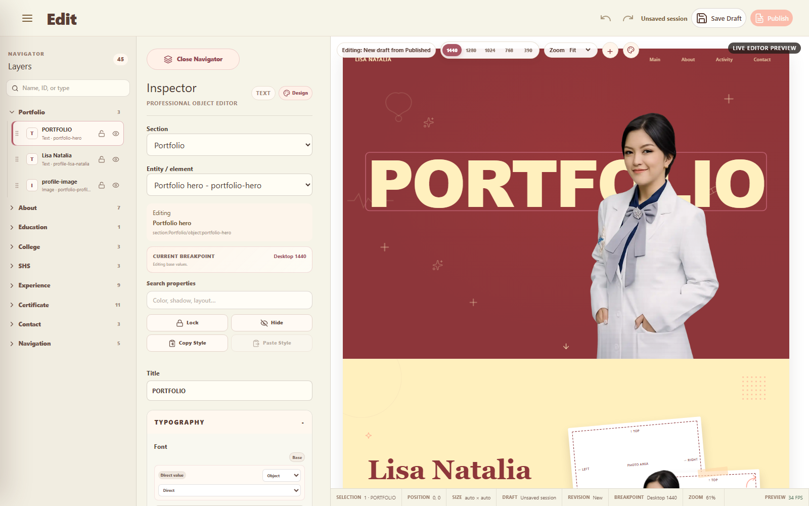
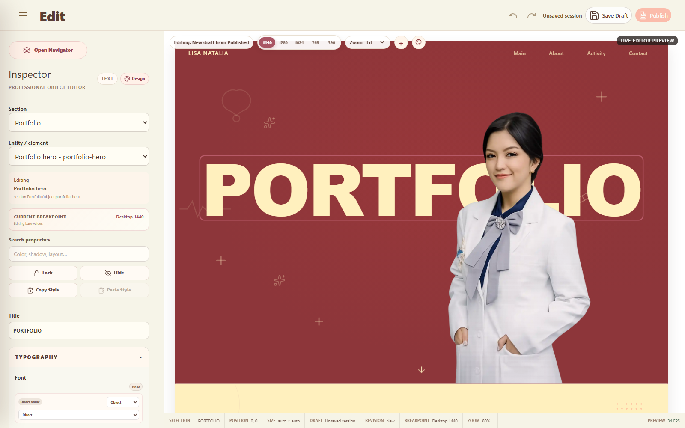

# Editor Navigator Collapse

Status: **PASS**  
Scope: UI layout only

## UI change

- Navigator can now be opened and closed from one 184 x 42 px pill button at the top of the Control Panel.
- The button uses the existing cream/rose palette and Layers icon. Its label is `Close Navigator` while open and `Open Navigator` while closed.
- Closing Navigator reduces its layout track to zero while the Control Panel keeps exactly the same width. No empty Navigator gap remains.
- All reclaimed width is given to the Canvas/Preview area. Navigator, Canvas, and Preview DOM nodes remain mounted; toggling does not reload or remount Preview.
- The transition duration is 200 ms. The mobile layout uses the same principle vertically: Inspector height stays constant and Canvas receives the reclaimed Navigator height.
- Closed Navigator is `inert`, `aria-hidden`, invisible, and non-interactive. The toggle exposes `aria-expanded` and `aria-controls` and has the existing visible focus treatment.

The preference is held by the existing Pinia editor store and persisted under `portfolio-editor-navigator-open`. It is deliberately separate from `EditorSnapshot`, content dirty state, session dirty state, and Undo/Redo history because this is a UI-only preference.

No Navigator content or behavior was changed. Search, Layers, lock, hide, collapse, rename, drag/reorder, and central selection still use the existing component and event flow.

## Screenshots

### Before — Navigator open

### After — Navigator closed

Both screenshots were captured at 1600 x 1000 and reopened for direct visual inspection. The supplied mockup was used as the request-level visual source. A separate repository design reference could not be compared because `design/` is absent in this checkout.

## Runtime validation

Focused browser harness: `tests/editor-navigator-collapse-runtime.mjs` — **PASS**.

| Assertion | Evidence |
|---|---|
| Navigator fully disappears | Width `270 px -> 0 px`; `visibility: hidden`; `aria-hidden=true`; `inert=true` |
| Inspector width remains constant | X `270 -> 0`; width stays exactly `384 px` |
| Canvas reclaims Navigator width | X `654 -> 384 px`; width `946 -> 1216 px` |
| Fit Preview grows with Canvas | Frame width `883 -> 1153 px` |
| No Canvas/Preview remount | Navigator, Canvas, and Preview Runtime retained identical DOM references |
| No Preview refresh | Targeted Preview update count remained `1` |
| Editor state remains stable | Selection stayed `portfolio-hero`; `Fit` mode stayed selected; an explicit `75%` Zoom also remained exactly `75%`; scroll stayed `160 px`; content dirty and history values were unchanged |
| Reload persistence | Reload restored closed state with zero-width Navigator and `Open Navigator` label |
| Responsive/mobile layout | Inspector height stayed `371.19 px`; Canvas height grew from `296.98` to `556.81 px`; Preview Runtime remained mounted |
| Navigator functionality | Search, selection sync, selected outline, lock, hide, rename, and keyboard drag/reorder all passed after reopening |

Full existing Editor browser regression: `tests/editor-professional-ux-runtime.mjs` — **PASS**. It independently verified selection, multi-selection, layer collapse/reorder/lock/hide/search/rename, Inspector/property binding, Undo/Redo, Save Draft dialog flow, Preview stability, accessibility checks, and measured approximately 60 FPS.

## Static validation

- `npx vue-tsc --noEmit` — **PASS**
- `npm run build` — **PASS** (Vite 8.2.1; 2,028 modules transformed)
- `git diff --check` — **PASS** (line-ending notices only)

## Scope protection

No changes were made to Repository, Snapshot, Selection Engine, Property Binding, Undo/Redo, Publish, Draft, Favorite, Guest Runtime, database, RLS, property metadata, Inspector behavior, Typography controls, Media controls, or `EditorObjectNavigator.vue` behavior/content.

No out-of-scope functional issue was found or implemented.
