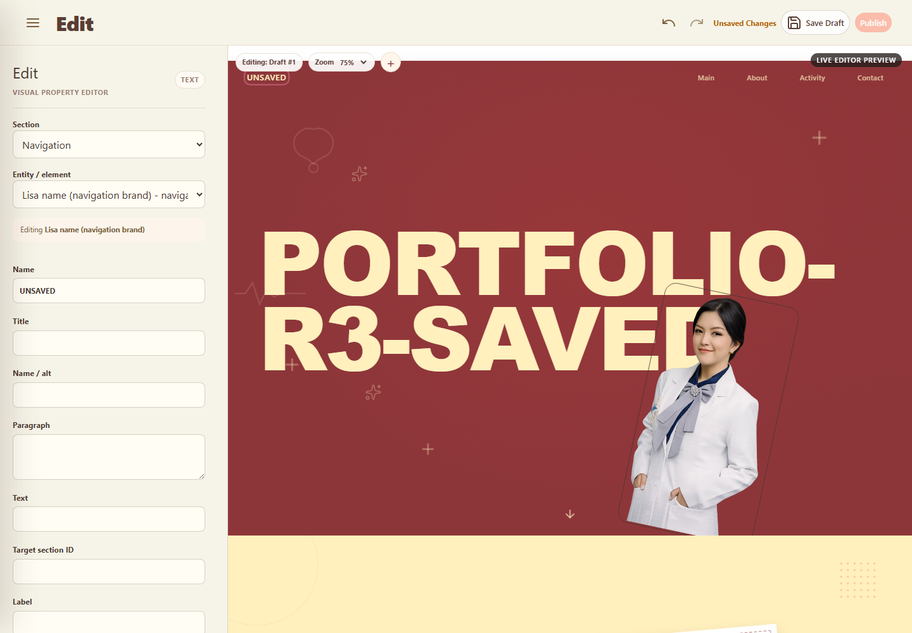
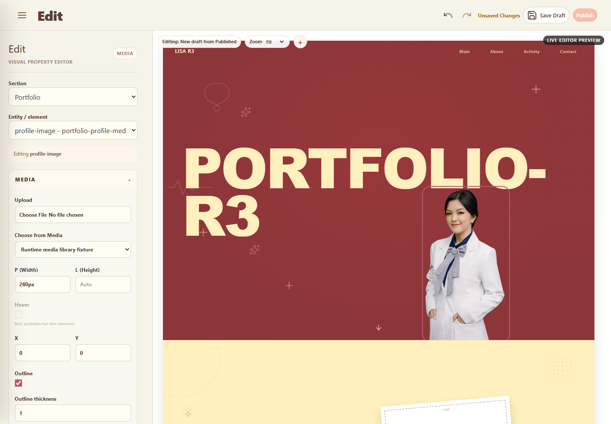
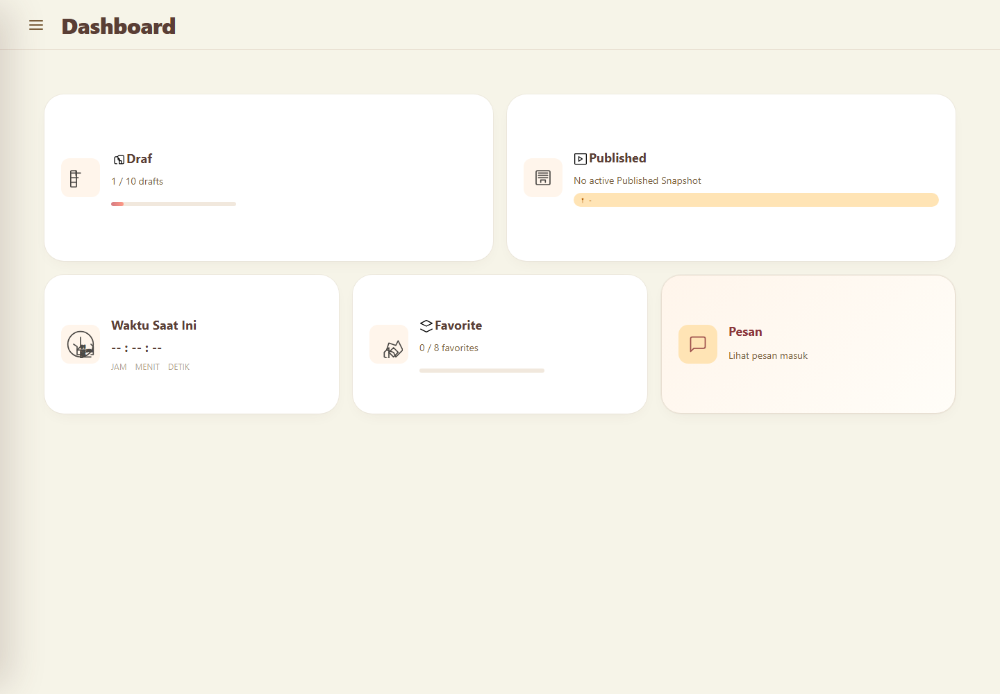

# PHASE 029F-R3 — Cloud Migration Fix + Editor Selection & Property Panel E2E

Date: 2026-08-27 (Asia/Jakarta)

Final verdict: **PARTIAL**

Phase 029G was not started. No Publish Pipeline, Guest Published Runtime cutover, Published Snapshot activation, or media promotion was implemented.

## Resume checkpoint

The repository was resumed from commit `531cfb8` (`editmedia`). The worktree was clean at the beginning of the resumed execution because the pre-limit implementation had already been committed. The R3 report was still missing and the project log ended at Request #132 (R2).

### Completed before the AI limit

- Applied Cloud migrations for `site_revisions`, Draft Library/Favorites, atomic Draft locking, Favorite DELETE grant, and the `created_by` query index.
- Reloaded the PostgREST schema cache.
- Verified table columns, RLS policies, grants, RPC signatures, Draft/Favorite server limits, stale-lock rejection, delete semantics, and rollback cleanup.
- Implemented centralized preview/manual selection, EditorSnapshot property binding, editor-only outlines, metadata-driven FONT/MEDIA groups, Draft/Favorite libraries, Dashboard cards, plus modal, session recovery, and in-memory runtime coverage.
- Fixed earlier save-error propagation, session restore, Certificate snapshot persistence, semantic media identity, discard authorization, stale Draft races, startup retry, and invalid snapshot rejection findings.

### Resumed after the AI limit

- Reconstructed Git, report, log, migration, and runtime state without restarting the phase.
- Replaced the disabled `Choose from Media` placeholder with a repository-backed selector using real `site.current.mediaAssets` data loaded through the existing Site repository boundary.
- Added metadata options and native select placeholder support to the generic property renderer.
- Added a logical `SET_IMAGE_REFERENCE` command for selecting existing media while preserving selection and live preview.
- Extended the browser harness to prove the repository-backed media selector.
- Corrected Favorite Dashboard card composition to match the same icon/content hierarchy and typography as related cards.
- Re-ran Cloud metadata/API checks, browser E2E, screenshot inspection, Vue typecheck, production build, and diff validation.
- Produced this report and updated the persistent implementation log.

## Cloud database and PGRST205 resolution

Remote Supabase Cloud migration history now includes:

- `site_revisions`
- `draft_library_favorites`
- `draft_lock_version`
- `favorite_delete_grant`
- `site_revisions_created_by_index`

Current remote evidence:

- `public.site_revisions` exists with RLS enabled and the expected columns, including `base_revision_number` and `lock_version`.
- `public.editor_favorites` exists with RLS enabled and references Draft revision IDs instead of copying snapshots.
- `save_editor_draft`, `discard_editor_draft`, `add_editor_favorite`, and `remove_editor_favorite` exist as security-invoker functions.
- Anonymous has no table SELECT privilege and no RPC EXECUTE privilege.
- Authenticated has the required revision read/write, Favorite insert/delete, and RPC EXECUTE privileges; RLS further limits operations to Admin workflows.
- Current Cloud rows after rollback-safe verification: 0 Drafts and 0 Favorites.

The exact anonymous PostgREST path used by the app was retried with the configured project URL and publishable key. It returned:

```text
HTTP 401
code: 42501
message: permission denied for table site_revisions
```

The Favorite path behaved the same way. This is the expected anonymous boundary and proves the table is present in the PostgREST schema cache. The previous `PGRST205` / “Could not find the table” response is resolved.

Before the limit, rollback-safe remote transaction tests also proved:

- a stale `lock_version` save is rejected atomically;
- Draft #11 is rejected while updates to existing Drafts remain allowed;
- Favorite #9 is rejected;
- removing a Favorite preserves its Draft;
- deleting a Draft cascades its Favorite relation;
- no test fixtures remain after rollback.

## Repository and Save Draft flow

```text
Admin Editor
  -> validate EditorSnapshot
  -> EditorDraftRepository.saveDraft(...)
  -> save_editor_draft RPC
  -> atomic lock/base comparison
  -> INSERT one new Draft or UPDATE the same Draft ID
  -> return revision_number + lock_version
```

- A new Published-derived workspace creates one Draft on its first successful Save.
- An existing Draft/Favorite-derived editor source updates the same Draft ID.
- Repeated Save does not create additional rows.
- Conflict/network failures propagate, keep dirty state, and never become `Saved`.
- Save Draft does not execute Publish and does not modify Guest state.

The in-memory browser runtime proved first-save/create, repeated-save/same-ID update, lock increment, conflict behavior, reload recovery, and history preservation. A real authenticated Cloud browser session was unavailable during the resumed execution, so a user-session Save that leaves a persistent Cloud row remains unverified. This is the reason the phase cannot honestly receive a full PASS.

## Editor selection model

The editor store is the single source of truth for `selectedEntityId` and `selectedSection`.

- Preview click reads `data-editor-entity-id` only.
- Semantic media IDs (`data-media-usage-id`, `data-photo-area-id`, certificate/entity IDs) are decorated into editor IDs inside the Admin preview.
- Manual Section/Entity selectors and preview click call the same selection action.
- Property writes use the current selected entity and never infer a new entity from the changed value.
- Restored entity, section, accordion, scroll, and user zoom are validated before applying a fallback.

Browser assertions passed for Portfolio title, navigation Lisa name, Certificate card, and profile media. Typing did not change selection.

## Selected outline

- Hover uses a thin dashed outline with transparent fill.
- Selected state uses a visible rounded rose outline with transparent fill.
- No overlay DOM covers the content, so there is no overlay pointer interception.
- Styling is scoped below `.editor-preview-runtime[data-editor-mode="true"]` and is not serialized into EditorSnapshot or Guest CSS.
- Selection moved to the exact text/media element selected in the browser harness.

## Metadata-driven Property Panel

The renderer remains generic. It maps metadata controls to input, textarea, select, checkbox, file, or button controls; it does not branch on FONT, MEDIA, or future category names.

Every visible property is registered through `PropertyRegistryEntry` metadata. New Video, Icon, Border Radius, Filter, Blend Mode, and similar properties can reuse registered controls and bindings without adding category-specific template branches.

### FONT

Metadata order is:

1. Font type
2. Size + Spacing
3. Color
4. Shadow
5. Hover
6. Position X + Position Y
7. Rotate

FONT is selected/open for typography-capable text entities. Unsupported Hover/position/rotate fields use native `disabled` according to entity capabilities. Snapshot and preview changes use command history.

### MEDIA

Metadata order is:

1. Upload
2. Choose from Media
3. P (Width) + L (Height)
4. Hover
5. Position X + Position Y
6. Outline
7. Outline thickness
8. Change image
9. Rotate

`Choose from Media` now reads actual repository-loaded media assets; it does not use dummy production data. Upload/replace remains scoped to the selected semantic photo area. Media commands update EditorSnapshot and the preview without changing selected entity.

### Dependency evidence

- Outline thickness is natively disabled while Outline is off and enabled after Outline is checked.
- Unsupported media Hover is natively disabled.
- Missing repository media disables the selector through metadata.
- Non-media entities do not expose an active MEDIA target.
- Non-text entities do not expose active FONT editing.

## Draft/Favorite and limits

- Draft identity is the stable revision UUID, never an array index.
- Draft limit is 10 at the trusted database boundary.
- Favorite limit is 8 at the trusted database boundary.
- Favorite stores only `(user_id, revision_id)` relation data.
- Removing Favorite deletes only that relation.
- Deleting Draft cascades Favorite and does not touch Published/Guest state.
- The Phase 029G contract remains explicit: future Publish must preserve both Draft and Favorite rows.

## Dashboard and source modal

- Draft, Favorite, and Message cards are full-card pointer and keyboard targets.
- Draft navigates to `/admin/drafts` and displays `X / 10 drafts`.
- Favorite navigates to `/admin/favorites` and displays `X / 8 favorites`.
- Published remains separate and reports the active Published revision only.
- Cards retain the cream/rose Admin palette, consistent radius/icon container/typography, focus state, and subtle elevation.
- The preview toolbar `+` opens two large source cards: Open from Draft and Open from Favorite.
- Unsaved switching offers Save Draft & Continue, Discard Changes & Continue, and Cancel. A failed Save blocks switching.

## Runtime evidence

Final isolated browser harness:

```json
{"status":"PASS","scope":"Phase 029F-R3 in-memory browser E2E","selection":true,"propertyPanel":true,"undoRedo":true,"draftFavorite":true,"authenticatedCloudSession":false,"publishExecuted":false}
```

The harness passed selection stability, live content/media changes, Certificate persistence, FONT/MEDIA structure, repository-backed media selection, native dependency disabling, draft-only upload references, command coalescing, 10-entry Undo/Redo history, same-ID Draft saves, session restore, plus-modal protection, Draft/Favorite semantics, Dashboard counts/navigation, and no Publish execution.

One initial rerun timed out before Vue bootstrap. Diagnostics were added and the immediate rerun plus final post-polish rerun both passed. No functional assertion had run in the failed startup attempt.

Screenshots captured and visually inspected:







No `design/` directory or relevant editor design reference exists in this checkout. Comparison against a formal design image was therefore not possible; only the rendered result and explicit Phase requirements were inspected.

## Static validation

Final commands on the resumed source:

```text
npx vue-tsc --noEmit  PASS
npm run build         PASS (1,939 modules transformed)
git diff --check      PASS
```

## Explicit completeness audit

| Part | Result | Evidence / limitation |
|---|---|---|
| A — Cloud migration | PASS | Tables, columns, RLS, functions, grants, migration history, and PostgREST schema-cache path verified. |
| B — Selection model | PASS | Central action and browser selection/typing assertions passed. |
| C — Selected outline | PASS | DOM/style assertions and transparent outline screenshot inspected. |
| D — Property panel structure | PASS | Metadata-generated FONT/MEDIA groups; no category renderer branch. |
| E — FONT accordion | PASS | Required metadata order, paired rows, live binding, disabled state, and Undo/Redo verified. |
| F — MEDIA accordion | PASS | Required order, repository media selector, upload/replace, dimensions, outline, rotate, and command path implemented; runtime-covered applicable controls. |
| G — Dependency rules | PASS | Native disabled assertions passed. |
| H — Save Draft Cloud persistence | PARTIAL | Cloud RPC/schema/atomicity and in-memory app save passed; no authenticated browser session was available to leave/reload a real Cloud Draft row. |
| I — Dashboard cards | PASS | Counts, keyboard navigation, routes, screenshot, and final visual correction verified. |
| J — Plus modal | PASS | Two source cards and three-option unsaved protection passed in browser harness. |
| K — Draft/Favorite behavior | PASS | Remote rollback tests plus in-memory browser tests passed; Publish was not implemented. |
| L — Runtime E2E | PARTIAL | Full isolated browser E2E passed; authenticated Cloud Admin E2E was not run because no session/credential was available. |
| M — Static validation | PASS | Typecheck, build, and diff check passed. |
| N — Report/log | PASS | This report and Request #133 log entry were produced. |

## Previous AI-limit self-check

**Did any required step get skipped because of the previous AI limit?**

No required step was silently skipped in the resumed work. The steps interrupted by the limit—final state reconstruction, media selector completion, final runtime reruns, screenshots, static validation, report, and log—were completed. The authenticated Cloud Admin browser sequence remains unverified because no authenticated session or safe credential was available, not because it was omitted or hidden.

## Remaining blocker

To promote this phase from PARTIAL to PASS, run the existing acceptance sequence in a real authenticated Admin session against Cloud: edit, Save Draft, verify the same Cloud row on repeat Save, hard refresh/restore, Favorite add/remove, Draft delete, and Dashboard count refresh. No source change or Phase 029G work is required to perform that verification.
