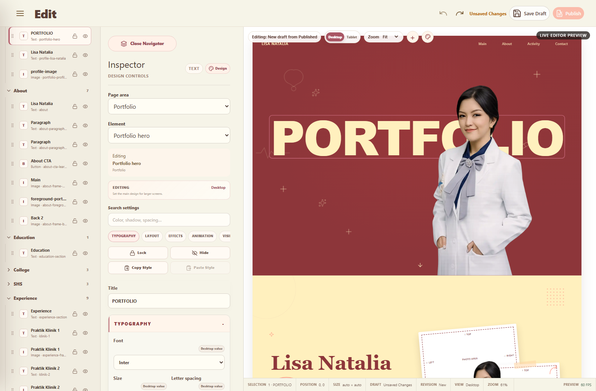
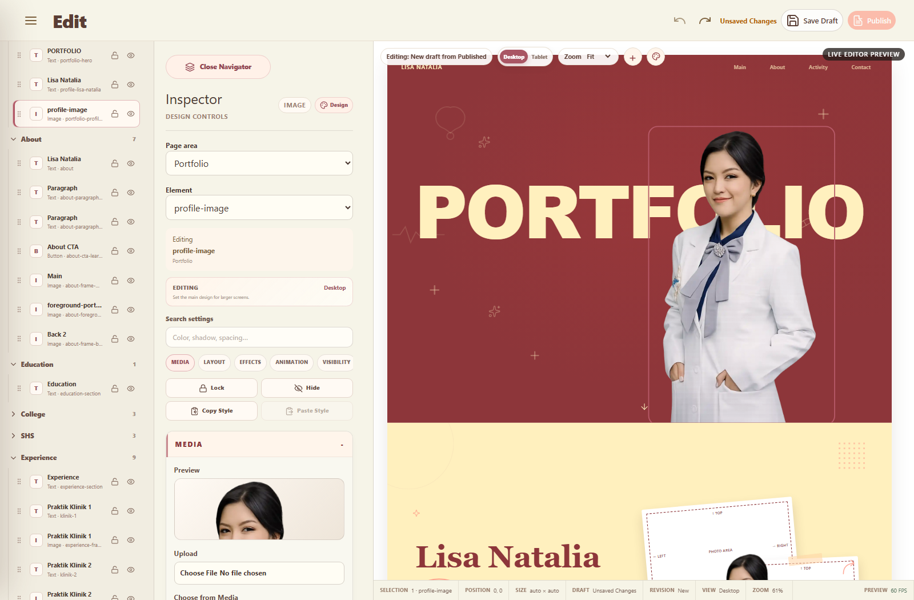

# PHASE 037A — Inspector Object Isolation, Semantic Deduplication & UX Cleanup

## Verdict

**PASS — local implementation and the twelve Phase 037A acceptance requirements.**

The object-targeting regression is fixed at its root. A selected leaf object now owns one DOM mutation target, one canonical command target, and one Preview marker. The focused browser matrix passes for Text, Image, Button, Container, Background, Divider, and Icon semantics; section isolation passes for Portfolio, About, Education, Experience, Certificate, and Contact.

One expressly non-blocking external evidence boundary remains: a disposable Cloud Publish/Guest/Rollback mutation was **NOT RUN** because `PHASE029G_SERVICE_ROLE_KEY` is unavailable. The application Cloud environment is configured and the authenticated Supabase MCP can read the revision/favorite tables, but the Cloud workspace currently contains no revision rows. No unsafe test user or production mutation was invented.

## 1. Root cause of section-wide movement

The canonical command path was already object-specific. The failure occurred later, at DOM resolution:

1. The legacy Guest template repeats the same semantic ID on both a section wrapper and its editable leaf. For `portfolio-hero`, the raw ID existed on `MAIN.main-content` and `H1.portfolio-title`.
2. Preview decoration copied the same `data-editor-object-id` to every matching node.
3. Property, responsive-layout, and animation runtimes independently queried all matching elements and broadcast each update to all of them.
4. Therefore `layout.portfolio-hero.x`, although canonically correct, applied a transform to both the H1 and the shared MAIN. Moving the MAIN also moved its profile image and decorations.

The bug was not fixed with compensating CSS. A shared semantic resolver now chooses exactly one owner:

- Text/content → semantic text leaf;
- Image/media → image/video/media leaf;
- Button/navigation → button or anchor;
- Icon → SVG/icon leaf;
- Divider → HR/divider leaf;
- Container/background → wrapper.

## 2. Exact files changed

Product/runtime implementation:

- `src/editor/objectDomTarget.ts` — authoritative semantic DOM owner resolver.
- `src/editor/propertyRuntime.ts` — applies/restores registered properties on one owner.
- `src/editor/responsiveLayout.ts` — applies responsive properties on the same owner.
- `src/runtime/animationRuntime.ts` — animation setup and Preview target the same owner.
- `src/pages/admin/AdminEdit.vue` — one-to-one Preview decoration, central target lookup, relevant runtime-property filtering, and Inspector visual hierarchy.
- `src/editor/inspectorPresentation.ts` — semantic ownership, deduplication, alignment presentation, Advanced cleanup, and hover terminology.

Verification:

- `tests/inspector-object-isolation-runtime.mjs` — new strict mutation/isolation harness.
- `tests/human-friendly-inspector-runtime.mjs` — text alignment, inventory, terminology, and round-trip assertions.
- `tests/editor-professional-ux-runtime.mjs` — search assertion now checks the actual queried Blur control rather than the deduplicated text box-shadow control.
- Existing subsystem harness expectations were retained/adapted to the Phase 037 friendly presentation without changing their architecture contracts.

Evidence:

- `artifacts/phase-037a-text-object-isolation.png`
- `artifacts/phase-037a-image-object-isolation.png`

During verification, Git `HEAD` was externally advanced to commit `cb016fa` (`ongoing fix bug`). That commit was preserved. A temporary native-scroll harness experiment included in that commit was reversed in the worktree to the original tracked harness content; no product scrolling code was changed.

## 3. Before/after property-target map

| Stage | Before | After |
| --- | --- | --- |
| Inspector selection | Selected ID was correct | Selected ID remains correct |
| Property presentation | Metadata key resolved correctly | Same metadata/property registry |
| `updatePanelProperty` | Object-specific command | Unchanged |
| `EditorCommand.entityId` | `portfolio-hero` | `portfolio-hero` |
| Canonical path | `layout.portfolio-hero.*` | Unchanged |
| Property runtime DOM | Every matching raw-ID element | One semantic object owner |
| Responsive runtime DOM | Every matching raw-ID element | Same semantic owner |
| Animation runtime DOM | Every matching raw-ID element | Same semantic owner |
| Preview marker | Duplicated on wrapper and leaf | Exactly one marker per object ID |
| Selected outline | Could bind common wrapper | Binds semantic leaf/frame/button |

Primary reproduction result:

| Control on `portfolio-hero` | H1 | Profile image | Decorations | Section root | Canonical non-target records |
| --- | --- | --- | --- | --- | --- |
| X | changed | unchanged | unchanged | unchanged | unchanged |
| Y | changed | unchanged | unchanged | unchanged | unchanged |
| Rotate | changed | unchanged | unchanged | unchanged | unchanged |
| Width | changed | unchanged | unchanged | unchanged | unchanged |
| Height | changed | unchanged | unchanged | unchanged | unchanged |
| Margin | changed | unchanged | unchanged | unchanged | unchanged |
| Padding | changed | unchanged | unchanged | unchanged | unchanged |
| Text alignment | changed | unchanged | unchanged | unchanged | unchanged |

## 4. Semantic duplicate inventory

| Semantic operation | Canonical/legacy candidates | User-facing owner after cleanup |
| --- | --- | --- |
| Text X/Y/Rotate | `font.positionX/Y/rotate`, `position.*`, runtime left/top/rotate | Typography only |
| Image X/Y/Rotate | `media.positionX/Y/rotate`, `position.*`, runtime left/top/rotate | Media only |
| Container X/Y/Rotate | `position.*`, runtime left/top/rotate | Layout only |
| Image W/H | `media.width/height`, `position.width/height`, runtime width/height/maxWidth | Media only |
| Container W/H | `position.width/height`, runtime width/height | Layout only |
| Text shadow | `font.shadow`, `effects.shadow`, runtime boxShadow | Typography Shadow |
| Image opacity/radius/border | `media.*`, `effects.*`, runtime appearance fields | Media only |
| Text alignment | legacy `layout.alignment`, `runtime.textAlign` | Typography Text alignment |
| Container child alignment | legacy `layout.alignment`, responsive container alignment | Layout Alignment, dependency-aware |

No canonical metadata was deleted. Duplicate presentations are hidden or moved to Advanced; persistence remains canonical and singular.

## 5. Controls removed from presentation only

These legacy runtime presentations are hidden because another visible control already owns the same selected-object effect:

- runtime left;
- runtime top;
- runtime width;
- runtime height;
- runtime maximum width;
- runtime transform rotation;
- runtime border radius;
- runtime box shadow;
- legacy `layout.alignment`.

The underlying registry entries and Snapshot data remain intact for compatibility.

## 6. Controls moved to Advanced

- Generic element/box shadow for Text and Button, where Typography already owns normal text shadow.
- Screen-specific raw visibility details.
- Original frame background mapping.
- Existing raw canonical values, token/source diagnostics, layer order, positioning behavior, flex/grid/constraint details, and technical responsive records.

Advanced duplicate-key rows are allowed only when their Inspector key starts with `details:` and they expose the same canonical value read-only/losslessly. No second editable normal action is rendered.

## 7. Controls hidden by object type

- Text: Media hidden; duplicate Layout transforms hidden; generic duplicate box shadow hidden from normal Effects.
- Image: Typography hidden; duplicate Layout X/Y/W/H/Rotate hidden; duplicate generic opacity/border/radius hidden.
- Button: Media hidden; Typography owns X/Y/Rotate/text alignment/text shadow; generic box shadow is Advanced.
- Container/Background: Typography and Media hidden unless the object explicitly declares those capabilities; Layout/Effects own geometry and appearance.
- Icon/Divider: only capability-declared controls resolve; unavailable controls are not exposed as active inputs.

## 8. Alignment semantics

Two unrelated meanings are now separated:

- Text alignment: `runtime.textAlign`, shown in Typography as Left, Center, Right, or Justify. It writes `typography.{id}.textAlign` and visibly changes the selected text only.
- Container alignment: `responsive.container.align`, shown in Layout only when the selected container has a compatible container mode. In the runtime test, Horizontal mode produced `display:flex`; Center alignment produced `align-items:center` on `about-frame-main` without directly styling its child.

The old `layout.alignment` presentation was a no-op for selected text because it wrote `justify-content` without a compatible container context. It is hidden rather than falsely presented as working.

## 9. Typography transform semantics

For Text and Button, normal X/Y/Rotate controls remain in Typography and write only:

- `layout.{selectedId}.x`;
- `layout.{selectedId}.y`;
- `layout.{selectedId}.rotation`.

The property runtime resolves the selected semantic leaf. Typing or dragging a value does not infer a new object or select a section wrapper.

## 10. Media transform semantics

For Image, normal X/Y/Rotate and W/H remain in Media and write only the selected image's layout record. Outline writes only `media.styles.{selectedId}`. The image matrix verified X, Y, rotation, width, height, opacity, radius, and outline against `portfolio-profile-media`; every command stayed on that ID and Undo restored the target.

While selected, the editor-only 3 px selection outline intentionally has visual priority over the design outline. The canonical/inline media outline (`currentcolor solid 5px` in the dependency test) is still applied and appears outside selection/Guest rendering; it is not a no-op.

## 11. Layout transform semantics

Layout owns generic position/dimensions only for objects whose normal Typography or Media panel does not already own them. A Container transform moves its owned subtree only when the Container itself is selected. Synthetic resolver evidence verified that a selected Container moved its child while an outside sibling remained unchanged.

Changing a target's intrinsic height or border can naturally reflow following document-flow elements. The harness distinguishes this from mutation leakage: those siblings had no canonical, inline-style, or computed-style mutation. X/Y/Rotate remain strict geometry-isolated and caused no sibling movement.

## 12. Effects deduplication

- Text: Typography Shadow is normal; generic box shadow is Advanced.
- Image: Media owns opacity, radius, and outline; duplicate generic Effects entries are hidden.
- Button: Typography owns text shadow; Effects owns genuinely distinct box opacity/border/radius; generic box shadow remains Advanced.
- Container/Background: Effects owns applicable generic visual properties.

## 13. Animation terminology audit

The engine and metadata were not redesigned.

- Typography `font.hover` is labelled **Hover style**.
- Animation `animation.hover` is labelled **Hover motion**.

They remain separate because one controls style-state presentation and the other controls motion/interaction animation. Entrance, Click, Scroll, Text, Timeline, Preset, Reset, and Copy/Paste behavior remains unchanged. The Phase 035 runtime passed at 60 FPS with reduced-motion behavior intact.

## 14. Advanced cleanup

Advanced remains collapsed and appears only when it contains relevant expert or diagnostic rows. It may expose raw canonical/source information, layer order, position behavior, grid/flex/constraint details, or responsive internals. It does not repeat an editable normal action. The strict harness compares normal keys with Advanced keys and rejects overlap unless the Advanced row is the explicit raw `details:` representation.

## 15. Capability matrix

| Selected type | Visible normal groups | Hidden | Disabled/dependent behavior |
| --- | --- | --- | --- |
| Text | Content, Typography, applicable Layout/Effects, Animation, Visibility, Interaction | Media; duplicate transforms/effects | Unsupported capability hidden; toggle dependents hidden/disabled |
| Image | Media, applicable Layout/Effects, Animation, Visibility, Interaction | Typography; duplicate geometry/effects | Replace requires media target; Outline Thickness requires Outline |
| Button | Content, Typography, Layout dimensions, distinct Effects, Animation, Visibility, Interaction | Media; duplicate text/box shadow presentation | Capability/dependency metadata governs availability |
| Container | Layout, Effects, Animation, Visibility, Interaction | Typography/Media without capability | Alignment requires compatible container mode |
| Background | Layout/Effects and declared behavior | Typography/Media without capability | Only declared capabilities active |
| Divider | Declared Layout/Effects | Unrelated Typography/Media | Synthetic semantic owner resolves to HR |
| Icon | Declared Layout/Effects | Unrelated controls | Synthetic semantic owner resolves to SVG/I |

## 16. Object-isolation E2E

`tests/inspector-object-isolation-runtime.mjs` finished with exit code 0 and explicit status `PASS`.

- one-to-one Preview markers: PASS;
- Text X/Y/Rotate/Width/Height/Margin/Padding/Alignment/Opacity/Blur/Radius: selected target only;
- Image X/Y/Rotate/W/H/Opacity/Radius/Outline: selected target only;
- Button X/Y/Rotate/W/H/Text alignment/Color/Text Shadow/Opacity/Border/Radius: selected canonical/DOM target only;
- Container ownership: selected wrapper moves owned subtree, not outside siblings;
- Background/Divider/Icon semantic resolution: correct target tags;
- selection stability: PASS;
- command entity/path and Undo restoration: PASS.

## 17. Section-isolation E2E

The same X mutation was executed on a selected Text object in each section:

| Section | Selected changed | Parent changed | Sibling changed | Non-target canonical changed |
| --- | --- | --- | --- | --- |
| Portfolio | yes | no | no | no |
| About | yes | no | no | no |
| Education | yes | no | no | no |
| Experience | yes | no | no | no |
| Certificate | yes | no | no | no |
| Contact | yes | no | no | no |

Owned descendants inside the selected Certificate/Contact text subtree remain part of that selected object; they are not classified as sibling leakage.

## 18. Responsive isolation

- Tablet Landscape X wrote only `layout.rwd-laptop-…x`.
- Desktop X wrote only `layout.portfolio-hero.x`.
- Tablet edit left the Desktop record unchanged.
- Desktop edit left the Tablet override unchanged.
- Undo restored both effective values.
- Preview root identity and selected object remained stable.
- Sibling geometry and canonical records remained unchanged.

The existing command engine may leave an empty responsive record after Undo once its final field is removed. It has no active override/effect and was not changed because sparse-record pruning belongs to canonical command/Snapshot behavior, outside this phase.

## 19. Draft/reload result

`tests/human-friendly-inspector-runtime.mjs` passed:

- friendly/canonical Typography and Media writes;
- Snapshot serialize/deserialize/validation;
- Undo/Redo;
- Save Draft through the repository boundary;
- route reload and session restoration;
- selected image restored;
- no unrelated text mutation.

## 20. Publish/Guest result

- Default/Published Guest contract: `tests/default-guest-runtime.mjs` PASS.
- Production Guest/SEO/PWA/backup runtime: `tests/production-hardening-runtime.mjs` PASS.
- Phase 035 Guest animation runtime: PASS.
- Authenticated Supabase MCP read-only query: `site_revisions` and `editor_favorites` are reachable; both currently contain zero rows.
- Disposable Cloud Save/Publish/Guest/Rollback mutation: **NOT RUN** because the required disposable service-role setup credential is absent. No production data was mutated.

The Publish, Rollback, Repository, Snapshot, Guest Runtime, database, RPC, RLS, and Storage implementations were not changed.

## 21. Screenshots

### Text object isolation

The selected outline follows the `PORTFOLIO` H1, not the section wrapper. The Inspector shows Typography and hides Media.

### Image object isolation

The selected outline follows the profile image. The Inspector shows Media and hides Typography.

Formal comparison against repository `design/` references was not possible because `design/` and `md/` are absent in this checkout. Visual verification used the rendered application and the explicit Phase 037A UI requirements. `Tidak ditemukan dalam specification.`

## 22. Regression results

| Harness / check | Result |
| --- | --- |
| Phase 037A object/section isolation | PASS |
| Human-Friendly Inspector | PASS |
| Professional Editor UX | PASS after correcting stale Blur assertion |
| Editor Object System | PASS |
| Responsive Layout | PASS, ~60 FPS |
| Design System | PASS, ~60 FPS |
| Animation System | PASS, 60 FPS and reduced motion |
| Media Library / picker / binding | PASS |
| Editor R3 Draft/Favorite local E2E | PASS on serial rerun |
| Default/Published Guest | PASS |
| Navigator collapse | PASS |
| Stabilization | PASS, ~60 FPS |
| Product Polish cross-page runtime | PASS, ~60 FPS |
| Production hardening runtime | PASS, ~61 FPS |
| Natural wheel/touchpad paths | PASS through all assertions before the native-thumb assertion |
| Native scrollbar drag rerun | INCONCLUSIVE in current CDP session; prior Request #151 evidence remains PASS (`scrollTop=702`) and relevant product source is unchanged |
| Disposable authenticated Cloud mutation | NOT RUN — no service-role test credential |
| `npx vue-tsc --noEmit` | PASS |
| `npm run build` | PASS — Vite 8.2.1, 2,037 modules |
| `git diff --check` | PASS; line-ending notices only |

The initial parallel regression run produced one transient CDP `Promise was collected` failure and two sandbox executable-access failures. Serial reruns passed; these were harness/process failures, not application assertions.

## Part A–Y audit

| Part | Result | Evidence / boundary |
| --- | --- | --- |
| A — Reproduce first | PASS | Wrapper and H1 duplicate target captured; control mutation diff recorded |
| B — Root cause | PASS | Broadcast DOM resolution identified and replaced centrally |
| C — Strict object isolation | PASS | Leaf/wrapper ownership matrix |
| D — Property ownership | PASS | Type-specific semantic ownership documented and asserted |
| E — Transform deduplication | PASS | One visible X/Y/Rotate owner per selected type |
| F — Width/height deduplication | PASS | One visible pair per applicable type |
| G — Alignment | PASS | Text alignment works; container alignment dependency works; legacy no-op hidden |
| H — Control relevance | PASS | Text has no Media; Image has no Typography |
| I — Dependencies | PASS | Outline toggle/thickness and capability rules asserted |
| J — Advanced cleanup | PASS | No duplicate editable normal action in Advanced |
| K — Animation audit | PASS | Hover Style/Motion separated; Animation regression passes |
| L — Effects audit | PASS | Text/Image/Button/Container ownership deduplicated |
| M — Information hierarchy | PASS | Runtime screenshots inspected; existing palette only |
| N — Field geometry | PASS | Paired rows, spacing, and category boundaries visually inspected |
| O — Unit presentation | PASS | Friendly px/degree presentation retained |
| P — Capability matrix | PASS | Text/Image/Button/frame plus semantic type fixtures |
| Q — No-op policy | PASS | Every enabled control exercised in focused matrices changed its selected target; legacy no-op alignment hidden |
| R — Object-level E2E | PASS | Text/Image/Button real runtime; Container/Background/Divider/Icon semantic fixtures |
| S — Section isolation | PASS | Six required sections |
| T — Responsive isolation | PASS | Base/Tablet sparse records independent |
| U — Draft/Publish contract | PARTIAL | Draft/reload + local Guest contracts PASS; disposable Cloud mutation NOT RUN |
| V — Test hardening | PASS | Selected, parent, siblings, canonical records, selection, command, Undo compared |
| W — Real bugs not hidden | PASS | Expected controls fixed; only genuinely duplicate/no-op presentation hidden |
| X — Static validation | PASS | Typecheck/build/diff |
| Y — Regression | PARTIAL | All product/subsystem harnesses PASS; current CDP native-thumb drag is inconclusive, Cloud mutation unavailable |

## Final acceptance checklist

1. Portfolio X/Y moves only selected text — **PASS**.
2. Rotate affects only selected object — **PASS**.
3. Image moves independently — **PASS**.
4. Container moves owned children only when selected — **PASS**.
5. Zero enabled no-op controls in the applicable visible-control matrices — **PASS**.
6. No duplicate user-facing semantic operation for one selected object — **PASS**.
7. Text does not expose active image controls — **PASS**.
8. Image does not expose active Typography controls — **PASS**.
9. Advanced contains expert/raw capability, not a duplicate normal action — **PASS**.
10. Alignment has a real target-specific effect or is unavailable — **PASS**.
11. Typography/Media/Layout/Effects/Animation/Visibility/Interaction/Advanced hierarchy is visually distinct — **PASS**.
12. Snapshot, Draft, Undo/Redo, Publish, Guest Runtime, Repository, database, RPC, RLS, and Storage architecture remain unchanged — **PASS**.

No Phase 038 work was started.
