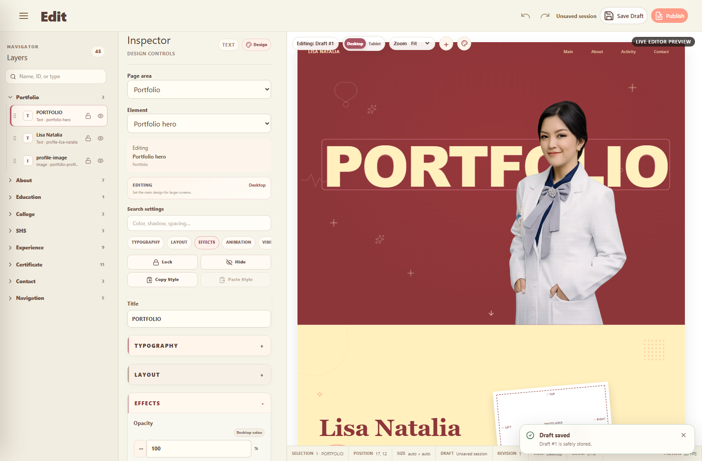

# PHASE 037B - Numeric Scrubber & Text Outline Correction

## Verdict

`PASS`

The two requested corrections are implemented and verified without changing EditorSnapshot, repositories, Draft/Favorite, Publish/Rollback, Guest architecture, responsive/animation architecture, storage, database, RPC, RLS, Navigator, or the Phase 037A semantic DOM resolver.

## 1. Numeric scrub root cause

The shared numeric control in `PropertyInputControl.vue` calculated drag distance from an absolute browser coordinate:

```text
(event.clientX - dragStartX) / 4
```

Once the physical pointer reached a monitor edge, `clientX` stopped changing, so the canonical numeric value also stopped changing. All registry-driven numeric fields use this shared control, including direct number metadata and friendly numeric adapters.

## 2. Pointer Lock implementation

The shared numeric control now uses this gesture lifecycle:

```text
pointerdown
  -> wait for 3 px drag intent
  -> activate scrub feedback
  -> request Pointer Lock when supported
  -> consume relative MouseEvent.movementX
  -> emit through the existing canonical setter
  -> pointerup / pointercancel / Escape / blur / unmount
  -> release Pointer Lock and listeners
```

A simple click never requests Pointer Lock and focuses the numeric input for direct editing. A session token also guards against a late-resolving Pointer Lock promise reactivating a finished gesture.

No second numeric state or persistence property was added. The transient scrub accumulator feeds the same `update:modelValue` path used by typing, keyboard changes, Preview updates, responsive ownership, EditorCommand, and Snapshot writes.

## 3. Fallback behavior

If Pointer Lock is unavailable or denied, the previous pointer-drag behavior remains available. The fallback uses incremental `clientX` movement and does not break click-to-type editing. No cursor-warping or browser-specific workaround was introduced.

## 4. Edge-of-screen evidence

Focused Chromium/CDP runtime evidence from `tests/numeric-scrub-text-outline-runtime.mjs`:

| Check | Evidence | Result |
| --- | --- | --- |
| Lock acquired after drag intent | value `0 -> 2` | PASS |
| Pointer moved to right edge | value `319.75` | PASS |
| Relative movement continued while physically at edge | `319.75 -> 359.75` | PASS |
| Reverse movement | `359.75 -> 339.75` | PASS |
| Release | Pointer Lock and active CSS class cleared | PASS |
| Escape | Pointer Lock and listeners cleared safely | PASS |
| Denied-lock fallback | `2 -> 12`, no lock | PASS |
| Simple click | focused input; value/history unchanged | PASS |
| Direct typing after scrub | friendly and canonical value both `17` | PASS |

During an active scrub the existing palette supplies a subtle active state, `ew-resize` is retained, and document text selection is temporarily disabled. Layout does not move.

## 5. Numeric coverage and Undo/Redo

The focused harness exercised the shared control against representative canonical paths:

| Control | Canonical path | Before -> scrubbed | Undo restored | History entries |
| --- | --- | ---: | ---: | ---: |
| Opacity | `backgrounds.portfolio-hero.opacity` | `100 -> 90` friendly value | `100` | 1 |
| X | `layout.portfolio-hero.x` | `17 -> 27` | `17` | 1 |
| Y | `layout.portfolio-hero.y` | `12 -> 22` | `12` | 1 |
| Width | `layout.portfolio-profile-media.width` | `520 -> 530` | `520` | 1 |
| Height | `layout.portfolio-profile-media.height` | `840 -> 850` | `840` | 1 |
| Rotate | `layout.portfolio-hero.rotation` | `0 -> 10` | `0` | 1 |
| Blur | `backgrounds.portfolio-hero.blur` | `0 -> 10` | `0` | 1 |
| Font Size | `typography.portfolio-hero.fontSize` | `208 -> 218` | `208` | 1 |
| Border/Outline Thickness | `backgrounds.portfolio-hero.border` | `3 -> 13` | `3` | 1 |

Every case kept the selected object stable. Existing command coalescing produced one logical history command per continuous scrub. Existing min/max, step, precision, Shift x10, Alt x0.1, disabled, responsive, and object-lock rules remain the authoritative path.

## 6. Text Border root cause

`effects.border` previously used the generic `stylePreview('border')` updater for every object type. The Phase 037A resolver correctly selected the `H1`, but the renderer applied a rectangular CSS box border to that selected text element. The target resolver was not the bug and was not changed.

## 7. Text Outline semantic mapping

The canonical property remains:

```text
backgrounds.{entityId}.border
```

There is no new Snapshot field and no parallel persistence model. Presentation and rendering now interpret that same canonical value according to selected object type:

| Object type | Friendly meaning | Rendering |
| --- | --- | --- |
| Text | Text Outline | glyph stroke |
| Image | Outline/Border | rectangular element border |
| Button | Border | rectangular button border |
| Container | Border | rectangular container border |

The Inspector presentation metadata supplies the Text-only label `Text Outline` and a `textOutline` control option. This stays metadata-driven; no category-specific renderer branch was added.

## 8. Canonical property reuse

`borderValue.ts` provides one shared parser and serializer for the existing CSS border shorthand. Example round trip:

```text
3px solid #b85b69
  -> { width: 3, style: solid, color: #b85b69 }
  -> 3px solid #b85b69
```

Unknown/custom canonical strings are preserved and remain available through Advanced. The friendly control does not silently destroy them.

## 9. Text renderer behavior

For Text objects, the existing Property Registry preview/runtime boundary now applies:

```css
border: none;
-webkit-text-stroke-width: <canonical thickness>;
-webkit-text-stroke-color: <canonical color>;
paint-order: stroke fill;
```

The browser-native glyph stroke preserves font family, font size, font weight, letter spacing, line height, alignment, hover/animation behavior, and multiline glyph geometry. No expensive stack of synthetic text shadows was added.

The Text UI contains only:

- Text Outline On/Off
- Thickness
- Color

It does not offer a fake stroke style selector.

## 10. Image, Button, and Container preservation

Published-runtime fixtures using the shared runtime updater produced:

| Object | Friendly label | Box border | Glyph stroke | Result |
| --- | --- | --- | --- | --- |
| Text | Text Outline | none | 2 px | PASS |
| Image | Border | 2 px solid | none | PASS |
| Button | Border | 2 px solid | none | PASS |
| Container | Border | 2 px solid | none | PASS |

No global border replacement occurred.

## 11. Selection outline and object isolation

The editor-only selection outline remains a separate `outline` style and is not canonical or published. The design Text Outline is a canonical glyph stroke.

Focused evidence for `portfolio-hero`:

- canonical Text Outline became `3px solid #b85b69`;
- computed box border was `none` / `0px`;
- computed glyph stroke was `3px rgb(184, 91, 105)`;
- selection outline remained visible and solid;
- selected object ID remained `portfolio-hero`;
- sibling and section-root fingerprints remained unchanged.

The full Phase 037A object/section/responsive isolation harness also passed after this change.

## 12. Responsive behavior

The responsive test retained sparse ownership:

| Breakpoint | Base | Sparse override | Computed stroke |
| --- | --- | --- | --- |
| Desktop | `3px solid #b85b69` | unchanged Tablet record | 3 px |
| Tablet Landscape | base preserved | `5px solid #b85b69` | 5 px |

Undo removed the Tablet override and restored the effective 3 px value. Redo restored the 5 px Tablet override. Desktop was not overwritten, selection stayed stable, and Preview root identity stayed stable.

## 13. Draft/reload and Guest evidence

Local repository/browser Draft round trip:

```text
Save Draft -> draft-1
Text Outline -> 3px solid #b85b69
scrubbed Y -> 12
route away -> reopen draft-1
same canonical values and 3 px glyph rendering restored
```

Repeated persistence used the existing Draft repository boundary. No Publish implementation was changed.

The focused shared Published-runtime fixture verified glyph stroke for Text and box borders for Image/Button/Container. `tests/default-guest-runtime.mjs` also passed the existing Default/Published selection, multiple publish revisions, rollback, and Draft/Favorite isolation contracts.

A fresh disposable Cloud Publish/Rollback mutation was `NOT RUN`: `PHASE029G_SERVICE_ROLE_KEY` is unavailable. No Cloud evidence is fabricated. This does not replace or weaken the passing local shared Published/Guest runtime contract.

## 14. Screenshot



The captured 1600 x 1050 runtime was opened and inspected at original detail. It shows `Text Outline` with Thickness 3 and color `#b85b69`, rose glyph strokes on `PORTFOLIO`, and the independent transparent editor selection rectangle. The repository has no `design/` reference in this checkout, so formal design-reference comparison is `Belum dilakukan` and additional visual specification is `Tidak ditemukan dalam specification`.

## 15. Regression results

| Validation | Result |
| --- | --- |
| Focused numeric Pointer Lock + Text Outline | PASS |
| Phase 037A object/section/responsive isolation | PASS |
| Human-Friendly Inspector | PASS |
| Professional Editor UX | PASS |
| Responsive Layout | PASS, approximately 59-60 FPS |
| Animation System | PASS, approximately 60 FPS |
| Editor R3 Draft/Favorite browser regression | PASS on serial rerun |
| Default/Published Guest runtime | PASS |
| `npx vue-tsc --noEmit` | PASS |
| `npm run build` | PASS, Vite 8.2.1, 2,038 modules |
| `git diff --check` | PASS; line-ending notices only |

One parallel Editor R3 run encountered a CDP `Promise was collected` harness race; the unchanged test passed when rerun serially. It was not an application assertion failure.

## Files

Created:

- `src/editor/borderValue.ts`
- `tests/numeric-scrub-text-outline-runtime.mjs`
- `artifacts/phase-037b-text-outline.png`
- `PHASE-037B-NUMERIC-SCRUB-TEXT-OUTLINE.md`

Modified implementation:

- `src/pages/admin/components/property-controls/PropertyInputControl.vue`
- `src/pages/admin/components/property-controls/PropertyBorderControl.vue`
- `src/editor/inspectorPresentation.ts`
- `src/editor/propertyRegistry.ts`

Required regression harnesses refreshed existing tracked runtime artifacts. No application UI outside the requested numeric scrub feedback and Text-only outline presentation was redesigned.

## Requirements self-audit

| Part | Status | Evidence boundary |
| --- | --- | --- |
| A - Numeric scrub audit | PASS | Shared absolute `clientX` root cause traced |
| B - Edge-independent scrub | PASS | Pointer Lock + relative `movementX` |
| C - Scrubber runtime | PASS | Edge, reverse, release, Escape, fallback, typing, 9 controls |
| D - Text Border bug | PASS | Rectangular Text border reproduced and corrected |
| E - Other object semantics | PASS | Image/Button/Container fixtures retain box border |
| F - Canonical audit | PASS | Existing `backgrounds.{entityId}.border` reused |
| G - Glyph rendering | PASS | Native text stroke; box border absent |
| H - Text Outline UI | PASS | On/Off, Thickness, Color; no fake Style |
| I - Image/box UI | PASS | Semantics preserved |
| J - Selection outline separation | PASS | Editor outline remains independent |
| K - Object isolation | PASS | Sibling/root fingerprints stable |
| L - Responsive | PASS | Sparse Tablet override; Desktop preserved |
| M - Undo/Redo | PASS | Text Outline and every numeric sample restored/redone |
| N - Draft round trip | PASS | Text Outline and scrubbed Y restored from same Draft |
| O - Publish/Guest contract | PASS locally; Cloud mutation NOT RUN | Shared Published runtime and Default/Published regression pass |
| P - No unrelated UI change | PASS | Requested boundaries preserved |

## Final acceptance audit

| # | Acceptance | Status |
| ---: | --- | --- |
| 1 | Scrub continues at physical screen edge | PASS |
| 2 | Scrub reverses naturally | PASS |
| 3 | Pointer Lock releases on gesture end/Escape | PASS |
| 4 | Normal numeric click/type remains functional | PASS |
| 5 | Text Outline follows glyphs | PASS |
| 6 | Friendly Text Outline creates no H1 box border | PASS |
| 7 | Image/Button/Container box-border semantics remain | PASS |
| 8 | Editor selection outline remains separate | PASS |
| 9 | Phase 037A selected-object isolation remains | PASS |
| 10 | Undo/Redo, Draft/reload, Responsive, and Published/Guest contracts remain | PASS |

No requested implementation step was skipped because of the previous AI usage-limit interruption. Phase 038 was not started.
