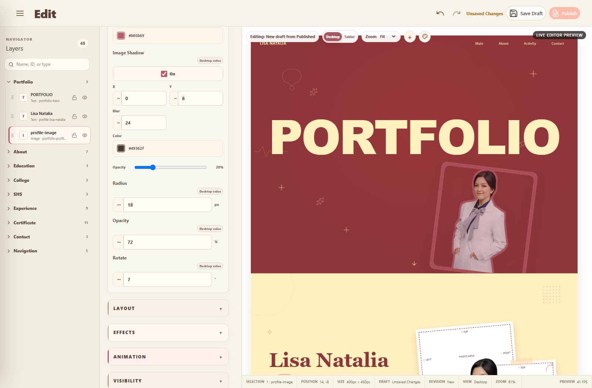

# PHASE 037C — Media Insertion Semantics, Image Geometry & Alpha-Aware Effects

## Verdict

**PARTIAL**

All defects that can be corrected inside the protected architecture are implemented and locally verified: action semantics, rendered W/H geometry, alpha-aware outline, alpha-aware shadow, real hover behavior, semantic deduplication, object isolation, responsive ownership, Undo/Redo, Draft round trip, and the shared Published/Guest renderer contract.

The phase is not marked PASS because arbitrary additional image instances are not representable by the current fixed-template Snapshot/Object/Guest renderer contract, and a fresh disposable Cloud mutation could not be run without a disposable Admin or service-role credential. No temporary DOM instance, parallel persistence model, or fabricated Cloud evidence was introduced.

## Sources and boundaries

- Consulted: the latest project history, repository `AGENTS.md`, current Property/Object registries, Editor store and command path, Media Library store/repository, fixed Guest section markup, responsive runtime, Published DOM runtime, and focused browser harnesses.
- Additional Phase 037C file under `md/`: **Tidak ditemukan dalam specification.**
- Relevant file under `design/`: **Tidak ditemukan dalam specification.**
- Formal comparison against a protected design reference: **Belum dilakukan.** The generated runtime screenshot was inspected directly.
- Unchanged contracts: EditorSnapshot schema, repositories, Draft, Favorite, Publish, Rollback, Guest architecture, responsive engine, animation engine, storage bucket/visibility, database, RPC, and RLS.

## 1. Upload current semantics

Previously, Upload and Replace shared the same handler and both replaced the selected page image. Upload now calls the existing Media Library store/repository upload path only. The asset is registered as reusable media under `portfolio-media/draft/library/...`; the selected image assignment, Preview, and command history remain unchanged.

The UI is now labelled **Upload New Image** and explains that it adds an asset to Media Library without replacing the selected image.

## 2. Choose from Media current semantics

Previously, choosing an asset immediately changed the selected image reference, making Choose and Replace semantically equivalent. Choose now opens the existing professional picker in browse mode. Search, Preview, Favorites, Recent, keyboard selection, and double-click remain provided by the same picker and repository identity.

Because the current fixed template cannot create another persistent image instance, choosing an item reveals that real asset in Media Library and does not mutate the page assignment or command history. The limitation is stated in the picker rather than hidden.

## 3. Reuse current semantics

`media.duplicateReference` generated another reference ID for the same fixed object. It did not create a second visual page instance. It was therefore redundant and misleading as “Reuse this image.” Its canonical action remains registered for compatibility, but the normal Inspector presentation hides it as `DUPLICATE / REDUNDANT`.

## 4. Final friendly action semantics

| Action | User-visible result | Page assignment | Asset deletion |
| --- | --- | --- | --- |
| Upload New Image | Upload/register reusable library asset | Unchanged | Never |
| Choose from Media | Browse/reveal an existing reusable asset | Unchanged under fixed-template boundary | Never |
| Replace Selected Image | Upload a new asset and assign it to the selected image only | Replaced with one `REPLACE_MEDIA` command | Old asset retained |
| Remove Selected Image | Unassign selected image instance/reference | Removed with one `DELETE_MEDIA` command | Underlying asset retained |
| Drag asset onto image | Explicitly assign existing asset to the semantic drop target | Changed with existing command path | Never |

## 5. Multiple-image instance architecture audit

The current architecture is fixed-template rather than arbitrary-child based:

- Object descriptors are derived from fixed runtime entities and photo-area IDs.
- `EditorSnapshot.media.assignments` assigns an asset to an existing entity ID; it does not describe an arbitrary child instance tree.
- `portfolio-profile-media` has no metadata `collectionPath`/repeatable-object contract.
- Guest sections render fixed Vue markup and do not iterate a canonical arbitrary image-instance collection.
- Serialization, Draft restore, Publish, and Guest rendering therefore have no stable location for Image B/Image C instances.

## 6. Insertion support decision

**ARCHITECTURAL BLOCKER.** Persistent arbitrary image insertion would require extending protected Snapshot/Object/Guest contracts. It was not implemented. No temporary DOM-only image was created, and no Editor-only store was introduced.

## 7. W/H root-cause audit

The prior tests asserted only canonical values and did not assert rendered geometry. After Phase 037A's semantic DOM resolution, the existing W/H updater targets the actual semantic ``, not its section wrapper. Phase 037C traced the cascade and found that the inline canonical width/height wins over template `auto`/max-size rules; the Canvas scale made the visual delta smaller than the canonical pixel delta.

No CSS workaround or second geometry state was needed. The hardened test now requires both canonical mutation and `getBoundingClientRect()` mutation.

## 8. W/H computed geometry evidence

Focused Chromium evidence for `portfolio-profile-media`:

| State | Canonical value | Rendered Canvas bounds |
| --- | --- | --- |
| Initial width | existing 520 px test state | approximately 318.86 px |
| Width changed | 400 px | approximately 245.28 px |
| Initial height | existing 584 px test state | approximately 445.14 px |
| Height changed | 450 px | approximately 275.94 px |

The difference between canonical and rendered numbers is the active Canvas scale. Only the selected image rect changed, and its editor selection frame followed the new bounds.

Aspect-ratio lock was audited. No canonical lock/aspect-ratio property exists for this object workflow, so no new state was added in this phase.

## 9. Image Outline root cause

The old image outline updater wrote CSS `outline` to the image box. That can only follow the rectangular element bounds and cannot represent a transparent PNG/WebP silhouette.

## 10. Alpha-aware outline implementation

The existing canonical properties are reused:

- enabled/width: `media.styles.{entityId}.outlineEnabled/outlineWidth`;
- color: existing `backgrounds.{entityId}.border` value, exposed as **Outline Color** for Image.

The Image renderer adapter creates one hidden, non-interactive SVG filter definition per runtime root/entity. `feMorphology` dilates `SourceAlpha`, `feComposite` removes the original alpha to form a ring, `feFlood` supplies canonical color, and `feMerge` combines the ring with `SourceGraphic`. Thickness changes the morphology radius directly.

The image itself receives no design `border`, `outline`, or `box-shadow`. The Editor selection rectangle remains separate and editor-only.

Runtime evidence: outline radius changed from 2 to 6; flood color changed to `#b85b69`; computed image filter contained `url(...)`; box shadow remained `none`.

## 11. Image Shadow root cause

The generic Effects updater used `box-shadow`, so a transparent portrait received a rectangular frame shadow. It also presented Spread even though native alpha-aware `drop-shadow()` does not implement CSS box-shadow spread semantics.

## 12. Alpha-aware shadow implementation

Image uses the same canonical `backgrounds.{entityId}.boxShadow` persistence record, parsed by the shared Shadow adapter and rendered as one or more CSS `filter: drop-shadow(...)` layers. Text/Button/Container continue using their existing glyph/box semantics.

The simple Image Shadow UI exposes On/Off, X/Y, Blur, Color, and Opacity. Spread is hidden for Image because it would be an enabled no-op. Legacy canonical spread data remains preserved but is not falsely represented as an alpha-spread control.

## 13. Hover root cause and behavior

`media.hoverEnabled` previously changed canonical metadata without any Preview updater or hover runtime class. It now uses the same semantic Image renderer and toggles `snapshot-runtime-media-hover` on the selected image. Pointer enter applies a subtle opacity emphasis; pointer leave restores the exact canonical base opacity. Motion remains owned by Animation and is not duplicated.

Focused evidence: base opacity `0.72`, pointer-hover opacity `0.6192`, pointer-leave opacity `0.72`. Reduced-motion removes the transition while preserving the non-motion style state.

## 14. Hover runtime evidence

- Real pointer move into and out of the image was dispatched through Chromium CDP.
- The semantic `` computed opacity changed on enter and restored on leave.
- Canonical hover configuration survived the local Draft round trip.
- The shared Published DOM fixture received the same hover class.

## 15. Media/Effects deduplication

For Image, Media is the sole friendly owner of W/H, X/Y, Rotate, Opacity, Radius, Outline, Image Shadow, and Hover Style. The existing `effects.shadow` registry entry is reused but presentation-moved to Media for Image; no duplicate property was created. Generic Image Effects duplicates stay hidden. Animation remains the owner of Hover Motion.

## 16. Manage Media integration

- Upload uses `useMediaLibraryStore().upload()` and the existing `uploadLibraryMedia()` repository boundary.
- Cloud path remains `portfolio-media/draft/library/{assetId}.{extension}`.
- SVG dimension decoding now safely falls back from `createImageBitmap()` to the native `Image`/object-URL path when Chromium cannot decode SVG via ImageBitmap.
- Asset ID, metadata, usage/favorites behavior, picker, and deletion safety remain in the existing Media Library.
- There is no direct Supabase call from Vue and no second media table/store.

## 17. Object isolation

The hardened browser test fingerprints the selected image, Portfolio text, Lisa Natalia text, decorations, section wrapper, and other images. W, H, X, Y, Rotate, Opacity, Radius, Outline, Shadow, and Hover changed only the selected semantic image target/canonical records. Selection remained `portfolio-profile-media` and the Preview root identity remained stable.

## 18. Responsive behavior

Desktop retained width 400 and outline thickness 6. Tablet Landscape stored sparse overrides of width 360 and outline thickness 8. Returning to Desktop restored 400/6. No Desktop base record was overwritten by the Tablet edit.

## 19. Undo/Redo

- W/H and semantic effects use existing property commands.
- Image Shadow Undo removed `drop-shadow(...)`; Redo restored it.
- Replace emitted one `REPLACE_MEDIA` command; Undo/Redo restored the old/new reference.
- Remove emitted one `DELETE_MEDIA` command; Undo restored the assignment.
- History remained within the existing ten-command limit.

## 20. Draft/reload result

The local repository/browser round trip saved `draft-1`, reopened the same Draft, and restored the same selected assignment, 400 x 450 geometry, outline enabled/width 6/color, alpha filter, shadow filter, hover configuration, and responsive overrides. Upload used one `draft/library/...` reference and did not re-upload during that route-level reload.

Persistent Cloud hard-refresh evidence is **NOT RUN** because only the publishable Cloud key is configured; no disposable Admin/service-role credential was available. This limitation is not represented as Cloud PASS.

## 21. Published/Guest result

The existing shared `applyPublishedSnapshotDom()` boundary rendered a local Published fixture with:

- selected media assignment;
- 400 x 450 dimensions;
- SVG alpha outline radius/color;
- CSS alpha-aware `drop-shadow(...)`;
- no rectangular `box-shadow` or design border;
- the same Hover Style class.

`default-guest-runtime.mjs` also passed Default/Published revision selection, rollback behavior, and Draft/Favorite isolation. Fresh Cloud Publish/Rollback mutation is **NOT RUN** because safe disposable credentials are unavailable.

## 22. Performance

The focused effect run measured approximately 60 FPS with p95 frame time approximately 16.7 ms. Preview root identity stayed unchanged and exactly one reusable SVG filter definition existed for the tested root/entity. There is no animation loop, duplicate watcher, repository call per property update, or Preview remount.

## 23. Screenshots

The screenshot was opened at original detail. It shows the rose outline following the transparent portrait silhouette, a separate transparent editor selection rectangle, and the Image Shadow controls. Formal design-reference comparison is unavailable because no relevant `design/` source exists.

## 24. Regression report

| Runtime | Result | Evidence |
| --- | --- | --- |
| Phase 037C focused Media | PASS | canonical + rendered geometry/effects, actions, isolation, round trip, performance |
| Phase 037B scrub/Text Outline | PASS | Pointer Lock and text/image/box semantic borders |
| Phase 037A isolation | PASS | filter-aware sibling/parent fingerprints and responsive isolation |
| Human-Friendly Inspector | PASS | labels, capability visibility, dependencies |
| Professional Editor UX | PASS | selection, commands, Preview, accessibility paths |
| Editor Object System | PASS | updated alpha-outline assertion, 45 objects, extensible Video metadata |
| Media Library | PASS | 302 assets, search, virtual grid, picker, safety actions |
| Responsive Layout | PASS | sparse overrides and approximately 60 FPS |
| Design System | PASS | token/theme/library round trips and approximately 60 FPS |
| Animation | PASS | animation runtime and approximately 60 FPS |
| Editor R3 Draft/Favorite | PASS | local repository/runtime contract |
| Default/Published Guest | PASS | Default, Published, rollback, Draft/Favorite isolation |
| Navigator collapse | PASS | stable Preview identity and editor state |
| Full stabilization browser audit | PASS | public/Admin desktop/mobile routes, no runtime errors |
| Natural scrolling | PARTIAL | ordinary wheel/touchpad-style assertions reached the final check; current headless CDP cannot drag the native Inspector thumb, and headful Chromium could not expose a target in this environment. No product scrolling source changed; the assertion was not weakened. |
| Fresh Cloud mutation | NOT RUN | no disposable Admin/service-role credential |

## Static validation

- `npx vue-tsc --noEmit`: **PASS**.
- `npm run build`: **PASS**; Vite 8.2.1, 2,040 modules transformed.
- `git diff --check`: **PASS**; line-ending notices only, no whitespace error.

## Part A–Z self-audit

| Part | Status | Notes |
| --- | --- | --- |
| A Media action semantics | PASS | Four distinct user-facing operations |
| B Insert vs Replace | PARTIAL | Replace is correct; arbitrary insert is blocked by protected fixed-template contracts |
| C Reuse audit | PASS | Redundant normal action hidden, underlying action retained |
| D Media panel semantics | PASS | Honest fixed-template copy; no fake insertion |
| E W/H | PASS | Canonical and rendered bounds both asserted |
| F Aspect ratio | PARTIAL | No canonical capability; intentionally not invented |
| G Alpha-aware outline | PASS | SourceAlpha morphology/composite filter |
| H Selection vs design outline | PASS | Separate editor-only and canonical effects |
| I Image shadow | PASS | Alpha-aware drop-shadow |
| J Type-specific shadow | PASS | Image alpha; text glyph; box objects box shadow |
| K Image Shadow UI | PASS | No fake Spread control |
| L/M Hover | PASS | Real enter/leave computed-style evidence |
| N Deduplication | PASS | One friendly semantic owner per Image property |
| O Capability rules | PASS | Media only for compatible Image object |
| P Object isolation | PASS | selected/sibling/parent fingerprints |
| Q Draft media persistence | PARTIAL | Local route round trip PASS; fresh Cloud hard reload NOT RUN |
| R Manage Media integration | PASS | Existing store/repository/path/identity reused |
| S Existing picker integration | PASS | Existing picker in browse mode |
| T Replace safety | PASS | Old asset retained; selected reference only |
| U Remove safety | PASS | Underlying asset retained |
| V Responsive | PASS | Desktop/Tablet sparse ownership |
| W Undo/Redo | PASS | geometry/effects/reference commands |
| X Draft/Publish/Guest | PARTIAL | local contract PASS; fresh Cloud mutation NOT RUN |
| Y Performance | PASS | ~60 FPS, stable root, one filter |
| Z Test hardening | PASS | canonical plus actual DOM geometry/filter/hover |

## Final acceptance checklist

| # | Requirement | Status |
| --- | --- | --- |
| 1 | Upload is not confused with Replace | PASS |
| 2 | Choose is not confused with Replace | PASS |
| 3 | Reuse has a unique purpose or is hidden | PASS — hidden as misleading/redundant |
| 4 | Insert only if canonical architecture supports it | PASS — audit says unsupported; no fake inserted |
| 5 | No temporary DOM-only insertion | PASS |
| 6 | W visibly changes selected image | PASS |
| 7 | H visibly changes selected image | PASS |
| 8 | Outline follows image alpha | PASS |
| 9 | Outline thickness visibly works | PASS |
| 10 | Shadow follows image alpha | PASS |
| 11 | Hover visibly works on real pointer hover | PASS |
| 12 | Effects change only selected image | PASS |
| 13 | Upload uses Manage Media | PASS |
| 14 | Replace retains old asset | PASS |
| 15 | Remove retains underlying asset | PASS |
| 16 | Desktop/Tablet ownership remains correct | PASS |
| 17 | Undo/Redo and local Draft reload remain correct | PASS |
| 18 | Local Published/Guest contract remains correct | PASS; fresh Cloud mutation NOT RUN |
| 19 | Protected architecture remains unchanged | PASS |

## Known limitations

1. A fixed section cannot contain newly inserted Image B/Image C instances without a future, explicitly approved extension of Snapshot/Object/Guest contracts.
2. There is no canonical aspect-ratio lock in this image-object workflow.
3. Fresh Cloud upload/save/publish/rollback cleanup was not run without disposable credentials.
4. Native scrollbar-thumb drag could not be re-certified in the current CDP environment; wheel/touchpad-style paths and the prior certified product behavior remain unchanged.

No Phase 038 work was started.
