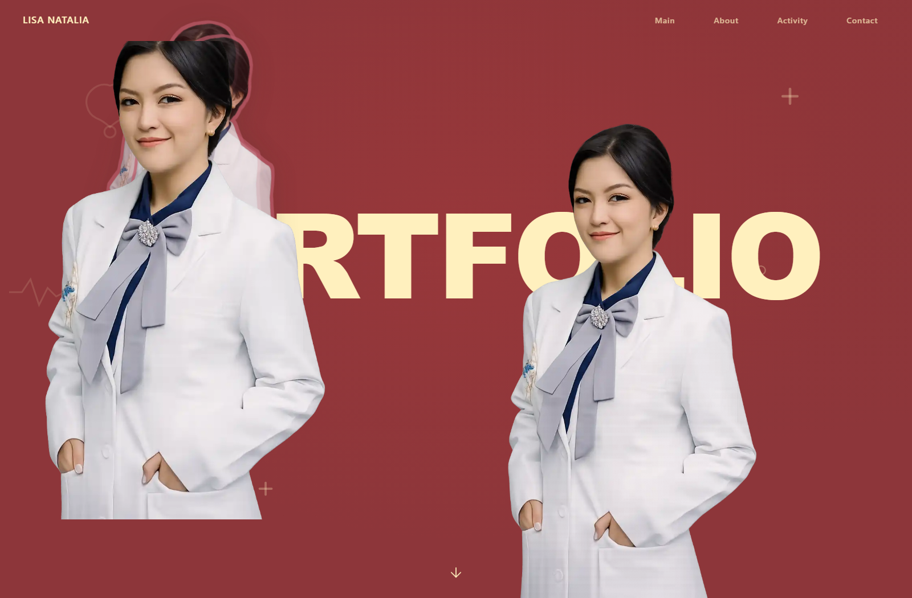

# PHASE 038A — Media Instance Integration Hardening

## Verdict

**PARTIAL**

The Phase 038A implementation and focused real-Vue browser runtime are complete. Upload, existing-media insertion, replacement, removal, duplication, independent geometry/effects, the 50-image limit, local Draft/Publish/Guest/Rollback contracts, and the shared upload boundary all pass.

One mandatory evidence item remains **NOT RUN**: a fresh hard browser reload of a Cloud-backed Draft through a real GoTrue Admin session. Supabase MCP database access is authenticated, but it is not an application Admin session and no disposable browser credential/service-role setup key was available. No Cloud-browser evidence is fabricated.

## Scope and sources

- Authoritative behavior: the user's Phase 038A instruction.
- Existing architecture reused: EditorSnapshot v2, dynamic instance commands, Object Registry, Media Repository, atomic Publish, Guest snapshot renderer, responsive overrides, and animation runtime.
- Local `md/` specification: `Tidak ditemukan dalam specification.`
- Local `design/` reference: `Tidak ditemukan dalam specification.`
- Formal reference-image comparison: `Belum dilakukan.`
- Actual Phase 038A Editor and Guest screenshots were opened at original resolution and inspected.

## 1. Real UI insertion root cause

The Inspector-to-repository-to-`INSERT_INSTANCE` flow was already reaching `EditorSnapshot.instances[]`, Object Registry, Navigator, and an actual ``. The remaining real-browser failure was in the shared DOM projection:

1. a dynamic image was appended as the final direct section child;
2. it used `position: absolute` with every inset set to `auto`;
3. the browser therefore used an append-location static position rather than the section origin;
4. fixed section content such as `.portfolio-layout` also occupied a higher stacking level;
5. the image could have valid canonical state and bounds while being covered or placed at the following section boundary, so it looked absent and could not receive pointer hover.

`src/runtime/dynamicInstanceRuntime.ts` now projects dynamic images into one runtime-only layer per section. The layer is anchored to the section's top-left containing block, sits above existing fixed section descendants, has `pointer-events: none`, and leaves each semantic image at `pointer-events: auto`. Existing image nodes are moved, not remounted. The canonical image remains the ``; no DOM-only page object or parallel persistence was introduced.

## 2. Editor versus Manage Media upload difference

Previously, upload acceptance was represented in more than one UI path. The completed implementation centralizes the product rules in `src/lib/mediaUploadRules.ts` and reuses that boundary from:

- original Manage Media upload UI;
- Editor `Upload New Image` preflight;
- `uploadLibraryMedia()` in the Media Repository as the final persistence-boundary validation.

Admin Vue components do not call Supabase directly.

## 3. Shared upload validation architecture

The shared function is `validateMediaUploadFile(file, purpose)`.

| Caller | Purpose | Persistence path |
|---|---|---|
| Manage Media | `library` | Media store -> Media Repository |
| Editor Upload New Image | `image` | Media store -> same Media Repository |
| Media Repository | `library` revalidation | `portfolio-media/draft/library/...` |

This keeps Editor's image-only filter narrower while preserving one authoritative format/size/MIME implementation and repository-owned storage/metadata behavior.

## 4. Actual supported upload rules

The tests use the existing product rules; no extra format was invented.

| Format | Manage Media | Editor image | Maximum |
|---|---:|---:|---:|
| WEBP | accepted | accepted | 2 MiB |
| GIF | accepted | accepted | 10 MiB |
| PDF | accepted | rejected | 2 MiB |
| PNG | rejected | rejected | n/a |
| JPEG/JPG | rejected | rejected | n/a |
| SVG | rejected | rejected | n/a |

MIME/extension mismatch and a file one byte above its limit are rejected. Files exactly at the configured limit are accepted. Browser evidence confirms that both Manage Media and Editor reject the same invalid PNG without creating an asset or page instance.

## 5. Upload New Image flow

`Upload New Image` now performs:

`File -> shared validation -> existing Media Library store/repository -> reusable draft/library asset -> INSERT_INSTANCE -> select new instance`.

Runtime evidence:

- selected source was Portfolio Text, proving section-scoped insertion does not require a hidden wrapper;
- the existing fixed profile image assignment remained unchanged;
- asset count increased by one;
- the uploaded asset had persisted metadata and `draft/library/<assetId>.webp` storage identity;
- Image B received a stable `portfolio-image-<uuid>` ID;
- Navigator, Inspector, status, and Preview converged on Image B.

## 6. Choose from Media flow

The existing Asset Picker is reused. Double-click/Apply returns the selected asset to the current insertion context and creates a new canonical instance without uploading another binary.

- Image C was created from `media-profile-primary`.
- Asset count did not increase.
- Image B and the fixed Image A remained.
- Choosing `media-profile-primary` again created Image D with a different stable ID.
- C and D share only the asset ID; their layout and media-style records are separate objects.

## 7. Replace flow

`Replace Selected Image` opens the existing Media Library picker. It does not expose a second local-file input.

The runtime test verifies:

- selected instance ID is unchanged;
- only its media assignment changes;
- W/H, X/Y, rotation, outline, shadow, hover, animation, responsive values, order, and state remain attached to that ID;
- the old Asset Library asset/reference remains available;
- Undo and Redo restore/reapply the assignment through `REPLACE_MEDIA`.

## 8. Remove flow

For a dynamic image, Remove executes `DELETE_INSTANCE` and cleans only that instance's canonical keyed records. The underlying media asset remains in Manage Media and other instances using the asset remain intact. No Storage delete is issued by the Editor action.

## 9. Duplicate flow

`Duplicate Image` and Ctrl+D use the existing Phase 038 canonical duplication command:

- new stable instance ID;
- same asset reference;
- deep-cloned visual/responsive/animation records;
- a small X/Y offset;
- independent edits afterward;
- Undo removes the duplicate;
- Redo restores the same ID and configuration.

No second duplication model was added.

## 10. Section targeting

The target is resolved from canonical object metadata with `findSnapshotObjectReference()` and normalized section identity. Portfolio Text, fixed/dynamic Portfolio Image, Background, and other registered Portfolio objects all resolve to `portfolio` when that rendered section exists.

If a valid rendered section cannot be resolved, insertion is disabled and reports `Select a page section first.` Silent failure is not used.

## 11. Instance independence proof

For Image B, the harness fingerprinted fixed Image A plus Images C/D before and after changing W, H, X, Y, rotation, opacity, radius, outline, shadow, hover, and responsive width.

| Target | Canonical record changed | Rendered target changed |
|---|---:|---:|
| Image B | yes | yes |
| Fixed profile image | no | no unintended canonical change |
| Image C | no | no unintended canonical change |
| Image D | no | no unintended canonical change |
| Portfolio section root | no | no |

Selection stayed on Image B and the Preview root/image node identity remained stable.

## 12. 50-per-section limit

The shared limit is now 50 image instances per section; the existing 500-per-snapshot safety limit remains.

Enforcement evidence:

- command preflight: 50 accepted, 51st rejected;
- Inspector preflight: upload disabled at 50 before binary upload, with a clear maximum message;
- EditorSnapshot validation: a fully shaped 50-instance Snapshot passes; a fully shaped 51-instance Snapshot fails;
- serialization and Draft reload preserve all 50;
- local Publish accepts all 50 atomically;
- rejected invalid Draft save leaves Draft count, history, and active Published Snapshot unchanged;
- Cloud `publish_editor_draft` now rejects section counts above 50.

Migration `0025_editor_instance_section_limit.sql` was applied through Supabase MCP as version `20260915131613` (`editor_instance_section_limit`). Read-only Cloud verification confirms:

- signature: `publish_editor_draft(uuid,jsonb,bigint,bigint,text)`;
- `SECURITY INVOKER` (`security_definer = false`);
- empty `search_path` configuration;
- anonymous EXECUTE: false;
- authenticated EXECUTE: true;
- function body contains `having count(*) > 50`.

No table, RLS policy, Storage bucket, or bucket visibility was changed. `portfolio-media` remains PUBLIC.

## 13. W/H root cause

The friendly numeric adapter can deserialize a legacy/numeric canonical length into a unitless string. Assigning a string such as `"400"` directly to CSS width/height is invalid, so the prior selection measurement could move while the semantic image retained template sizing.

The shared property runtime `cssLength()` now restores the established pixel meaning for unitless numeric strings before applying them. Dynamic images additionally use explicit top/left section origin and `max-width/max-height: none`, so template/static-position rules cannot mask their geometry.

## 14. Actual IMG geometry evidence

Focused browser results:

- fixed profile image bounds changed from approximately `318.86 x 515.08` Canvas pixels to `245.28 x 445.14`, then to `245.28 x 275.94` as W/H changed;
- fixed semantic IMG computed style ended at `400px x 450px`;
- new Image B began at canonical/computed `520px x 840px`;
- Image B later computed `300px x 544.459px` with proportional lock;
- Image B's `getBoundingClientRect()` width and height both changed;
- the selection indicator follows semantic IMG geometry and is not the geometry source.

Canvas-scale differences are expected; canonical CSS dimensions and the scaled client rect move proportionally.

## 15. Aspect-ratio evidence

The uploaded WEBP metadata is `740 x 1343`, ratio `0.5510052122`.

- unlocked W/H are independent;
- after locking, Desktop W `300px` produced H `544.459px`;
- Tablet Landscape W `260px` produced H approximately `471.865px`;
- the base Desktop record remained `300px`; Tablet used its existing sparse override record.

Both canonical values and actual semantic IMG computed dimensions were asserted.

## 16. Outline versus selection separation

Image design Outline uses the existing canonical media/background records and the shared SVG SourceAlpha renderer. Editor selection remains a thin editor-only CSS outline.

Tests changed image outline thickness through `2 -> 8 -> 18 -> 6`:

- SVG morphology radius followed each value;
- outline color changed to `#b85b69`;
- effect was on the semantic IMG filter;
- semantic IMG `box-shadow` remained `none`;
- Editor selection outline computed value stayed byte-identical at every thickness.

## 17. Alpha-shadow evidence

Image Shadow reuses canonical `backgrounds.{instanceId}.boxShadow` and is rendered as alpha-aware `filter: drop-shadow(...)` on the semantic IMG. It is not applied to the runtime layer, wrapper, or selection indicator. Text/Button/Container box/glyph semantics are unchanged.

## 18. Outer/Inner spacing semantic audit

| Object type | Normal geometry/spacing UI | Advanced/hidden behavior |
|---|---|---|
| Plain Text | typography size/letter spacing, one X/Y/Rotate path, meaningful Width/Height | generic margin/padding moved to Advanced |
| Image | Media W/H, X/Y, Rotate | generic margin/padding moved to Advanced |
| Button | Width/Height plus meaningful outer/inner spacing | retained in normal Layout |
| Container/Card | layout mode and meaningful spacing/alignment | retained where capability applies |

Canonical margin/padding support was not deleted.

## 19. Text/Image/Container control visibility matrix

| Control family | Text | Image | Button/Container |
|---|---|---|---|
| Upload / Choose new section image | visible, section-scoped only | visible | visible when section resolves |
| Replace / Remove / Duplicate image | hidden | visible when assignment supports it | hidden |
| Image W/H, Outline, Shadow, Hover | hidden | visible | hidden |
| Typography | visible | hidden | visible for Button only |
| Generic margin/padding | Advanced | Advanced | normal when meaningful |
| Duplicate geometry controls | hidden | hidden | one semantic owner |

Prior Phase 037 harnesses were updated only where their expectations conflicted with the explicitly authorized Phase 038A semantics. They continue to assert that Text/Button never expose image geometry or image effects.

## 20. Fit control decision

Fit is shown only when the selected image descriptor has a real `media-fit` path/capability. The fixed profile image and dynamic free image do not expose a nonfunctional segmented control. A frame-backed image with an actual fit capability retains the control. There is no enabled no-op Fit control.

## 21. Draft hard reload

Local actual-Vue evidence:

- A/B/C/D persisted through Save Draft;
- route teardown/remount and repository reload restored the same IDs, assignments, layouts, media styles, responsive overrides, and animation records;
- no media binary was uploaded again;
- duplicate Undo/Redo restored the exact duplicate ID.

Fresh Cloud-backed hard browser refresh with a real GoTrue Admin session is **NOT RUN** for the credential reason stated in the verdict. This is the only reason the phase is not certified PASS.

## 22. Publish / Guest

The actual Vue runtime with the production repository interfaces backed by the isolated in-memory implementation verified:

- revision 1 published A/B/C/D in one complete Snapshot;
- Draft and Favorite remained;
- Guest read Published only;
- all published media references were under `portfolio-media/published/...`;
- multiple instances sharing one asset shared one promoted media reference rather than duplicating the binary;
- deleting C from Draft did not alter Guest before publish;
- revision 2 updated Guest after publish.

Fresh Cloud mutation was not run; the Cloud Publish function's 50-limit/security configuration was verified read-only through MCP.

## 23. Rollback

Local rollback created a new rollback revision, restored the earlier A/B/C/D Published collection, retained published media paths, and did not restore C into the independently edited Draft. Favorite remained true and history contained both publishes plus rollback.

## 24. Screenshots and visual inspection

The screenshot shows the original fixed image plus dynamic images visibly coexisting in Portfolio, Image B selected in Navigator/Inspector, independent geometry in the status bar, and no empty/covered insertion result.

The Guest screenshot confirms dynamic images are projected from the Published rollback Snapshot rather than Draft. Both files were opened at original resolution. No formal design-reference comparison was possible because the required local reference does not exist.

## 25. Regression results

| Check | Result | Evidence |
|---|---|---|
| Dynamic instances / Phase 038A | PASS | actual Vue browser, canonical + DOM + pointer assertions |
| Phase 037C image effects | PASS | fixed IMG W/H, real hover, alpha outline/shadow, Draft/Guest |
| Phase 037B scrub/Text Outline | PASS | Pointer Lock and glyph outline harness |
| Phase 037A isolation | PASS | selected/parent/sibling canonical and DOM fingerprints |
| Human-Friendly Inspector | PASS | adapters, capabilities, dependencies, Save/reload |
| Professional Editor | PASS | selection, multi-select, controls, shortcuts, ~59 FPS |
| Editor Object System | PASS | metadata-driven object runtime |
| Media Library/original Manage Media UI | PASS | upload/search/filter/CRUD/picker/usage; UI preserved |
| Responsive | PASS | sparse Desktop/Tablet ownership |
| Animation | PASS | shared animation runtime |
| Draft/Favorite | PASS | Phase 029F-R3 browser harness and Phase 038A preservation |
| Local Publish/Rollback/Guest | PASS | two publishes and rollback |
| Default Guest | PASS | Default/Published selection and isolation |
| Navigator | PASS | collapse, select, rename, lock, hide, reorder, dynamic layers |
| Natural wheel/touchpad-style scroll | PASS | Navigator/Inspector/Preview native wheel events not prevented |
| Native scrollbar-thumb drag | NOT RUN | synthetic CDP cannot certify browser-native thumb dragging; no false PASS |
| Design System | PASS | Phase 034 harness |
| Product polish/stabilization | PASS | product and stabilization harnesses |
| Maintenance/production hardening | PASS | backup/ZIP/import validation/diagnostics |
| PWA/offline | PASS | service worker, cache, offline fallback, recovery |
| Fresh Cloud GoTrue browser mutation | NOT RUN | no disposable application Admin credential |

Performance evidence:

- dynamic-instance Preview: `58.68 FPS`, same Preview root and same Image B node;
- fixed image effects: `57.12 FPS` with no continuous repaint loop;
- Professional Editor: approximately `59.02 FPS`;
- production Guest: approximately `61.00 FPS`.

## Files involved

Implementation completed before/resumed after the interruption:

- `src/lib/mediaUploadRules.ts`
- `src/repositories/mediaRepository.ts`
- `src/pages/admin/AdminMedia.vue`
- `src/pages/admin/AdminEdit.vue`
- `src/pages/admin/components/AssetPickerModal.vue`
- `src/editor/editorInstances.ts`
- `src/editor/objectRegistry.ts`
- `src/editor/inspectorPresentation.ts`
- `src/editor/propertyRegistry.ts`
- `src/stores/editor.ts`
- `src/runtime/dynamicInstanceRuntime.ts`
- `supabase/migrations/0025_editor_instance_section_limit.sql`

Verification hardening:

- `tests/dynamic-editor-instances-runtime.mjs`
- `tests/media-image-effects-runtime.mjs`
- `tests/media-library-runtime.mjs`
- `tests/inspector-object-isolation-runtime.mjs`
- `tests/human-friendly-inspector-runtime.mjs`
- `tests/editor-professional-ux-runtime.mjs`
- `tests/editor-natural-scroll-runtime.mjs`

## Part A–Z self-audit

| Part | Result | Notes |
|---|---|---|
| A Real UI reproduction | PASS | actual Vue Inspector and semantic IMG asserted |
| B Insertion trace | PASS | repository through DOM traced; projection defect fixed |
| C Section targeting | PASS | canonical metadata resolution and clear disabled reason |
| D Instance independence | PASS | stable IDs and separate keyed/deep-cloned records |
| E 50-image limit | PASS | UI, command, Snapshot, local persistence/Publish, Cloud Publish validator |
| F Shared upload pipeline | PASS | one validator plus existing repository boundary |
| G Editor Upload semantics | PASS | registers asset, inserts, auto-selects |
| H Choose semantics | PASS | inserts without binary duplication |
| I Replace semantics | PASS | existing picker, same ID/config, old asset retained |
| J Remove semantics | PASS | instance only; asset retained |
| K Duplicate Image | PASS | independent canonical clone and Undo/Redo |
| L W/H rendering | PASS | fixed and dynamic semantic IMG rects change |
| M Aspect ratio | PASS | actual Desktop/Tablet image geometry |
| N Outline separation | PASS | alpha design filter versus constant editor selection UI |
| O Outline thickness | PASS | morphology 2/8/18/6; selection unchanged |
| P Image Shadow | PASS | semantic IMG drop-shadow; no wrapper box shadow |
| Q Outer/Inner audit | PASS | semantics documented |
| R Leaf Image rule | PASS | normal spacing hidden; canonical capability retained |
| S Text spacing | PASS | normal generic margin/padding hidden |
| T Geometry deduplication | PASS | one normal semantic owner per type |
| U Fit | PASS | hidden when unsupported; retained where real |
| V Selection after insert | PASS | Store/Navigator/Inspector/Preview same ID |
| W Navigator | PASS | independent dynamic actions |
| X Draft/reload | PARTIAL | local repository/remount PASS; fresh Cloud hard reload NOT RUN |
| Y Publish/Guest | PARTIAL | local actual-Vue contract PASS; fresh Cloud browser mutation NOT RUN |
| Z Rollback | PARTIAL | local contract PASS; fresh Cloud browser mutation NOT RUN |

## Final acceptance audit

| # | Requirement | Result |
|---:|---|---|
| 1 | Editor and Manage Media share validator/repository path | PASS |
| 2 | Accepted upload registered in Manage Media | PASS |
| 3 | Upload creates a new canonical image instance | PASS |
| 4 | Existing image remains unchanged | PASS |
| 5 | Choose creates another image instance | PASS |
| 6 | Same asset creates independent instances | PASS |
| 7 | Replace uses existing Media picker | PASS |
| 8 | Replace preserves ID/configuration | PASS |
| 9 | W/H resize actual IMG | PASS |
| 10 | Aspect lock changes actual dimensions | PASS |
| 11 | Design Outline follows alpha silhouette | PASS |
| 12 | Editor selection outline stays independent | PASS |
| 13 | Image Shadow follows alpha silhouette | PASS |
| 14 | Irrelevant Image spacing hidden in normal UI | PASS |
| 15 | Plain Text avoids redundant spacing controls | PASS |
| 16 | Button/Container controls retained | PASS |
| 17 | 50 accepted; 51st rejected safely | PASS |
| 18 | New image selected and shown in Navigator | PASS |
| 19 | Draft hard reload preserves independent instances | PARTIAL — local reload PASS; fresh Cloud hard refresh NOT RUN |
| 20 | Publish/Rollback preserve canonical independence | PASS locally; Cloud browser mutation NOT RUN |
| 21 | No parallel persistence/media/Supabase path introduced | PASS |

No implementation item was skipped because of the AI usage-limit interruption. The remaining item is an external authenticated-browser evidence gap, not unfinished implementation.

## Static validation

- `npx vue-tsc --noEmit`: PASS
- `npm run build`: PASS (`2044` modules; build completed)
- `git diff --check`: PASS; only line-ending conversion warnings were emitted

