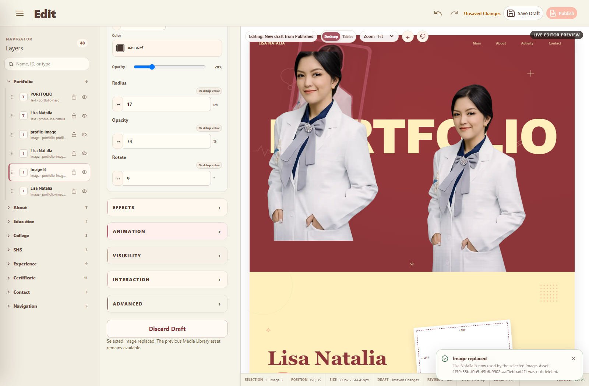

# PHASE 038B — Media Source Resolution & Image Load Integrity

## Verdict

**PASS**

The broken-image regression is fixed at the shared media-source boundary. Fixed images, uploaded dynamic images, existing-media instances, duplicates, replacements, local Published Guest images, and the Inspector thumbnail now resolve from the same canonical assignment/reference model and must decode before the runtime harness accepts them.

A fresh mutating Cloud Draft/Publish session was **NOT RUN** because no disposable GoTrue Admin credential or service-role setup key was available. This phase used the explicitly permitted local actual-browser fallback plus a configured, read-only Cloud browser probe. No Cloud evidence is fabricated.

## Scope and sources

- Authoritative behavior: the user's Phase 038B instruction.
- Existing architecture retained: EditorSnapshot v2, Repository contracts, Phase 038 instances, Draft/Favorite, Publish/Rollback, Guest source isolation, Storage bucket, database, and RLS.
- `portfolio-media` remains **PUBLIC**. No bucket or visibility change was made.
- Relevant local `md/` specification: `Tidak ditemukan dalam specification.`
- Relevant local `design/` reference: `Tidak ditemukan dalam specification.`
- Formal design-reference comparison: `Belum dilakukan.`
- The Phase 038B runtime screenshot was opened and inspected at original resolution.

## 1. Exact broken-image root cause

Two independent defects produced the same visible symptom.

1. A canonical Storage object path such as `draft/library/<asset>.webp` could reach an `` without being converted into a browser URL. Vite then returned its HTML fallback with HTTP 200, but the browser could not decode it: `complete === true`, `naturalWidth === 0`, and `naturalHeight === 0`.
2. Draft preview resolution used a signed-URL branch even though the established `portfolio-media` bucket is public. The real configured-browser reproduction returned HTTP 400 JSON for that path instead of image bytes.

The pre-fix test therefore demonstrated why checking only for an IMG node or HTTP 200 was insufficient.

## 2. Fixed-image assignment diagnosis

The selected fixed object `portfolio-profile-media` correctly retained this assignment:

`portfolio-profile-media -> media-profile-primary`

However, `SupabaseSiteRepository.load()` previously replaced the complete built-in media asset and usage collections whenever any global `media_assets` row existed. In the observed Cloud state, one library asset existed while no replacement `entity_media` rows existed. The replacement removed `media-profile-primary` but left fixed usage IDs referring to it, causing:

- a dangling fixed assignment;
- a blank Canvas source;
- `naturalWidth === 0`;
- Inspector text `No media assigned`.

The loader now merges persisted rows by stable ID into the immutable default records. It no longer drops unrelated fixed media records.

## 3. Dynamic-image assignment diagnosis

Dynamic rendering previously fell back directly to `reference.uri`. That field is canonical data and may be a Storage path, not a browser URL. Dynamic instances now use the shared resolver before assigning `src`.

Snapshot validation was also hardened:

- reference asset IDs must be unique;
- every fixed or dynamic media assignment must resolve to an existing reference;
- dangling fixed and dynamic assignments are rejected before Draft/Publish persistence.

The v1 reader, v2 writer, instance schema, and persistence model were not changed.

## 4. Canonical media reference model

The unchanged canonical chain is:

`entity/instance ID -> media assignment -> asset ID -> media reference -> source resolver -> browser URL`

Storage identity remains `bucket + storagePath`; a temporary blob URL is never used as persistent identity. The resolver accepts the existing canonical fields:

- `uri`;
- `sourceUrl`;
- `bucket`;
- `storagePath`;
- optional repository-owned transient preview URL.

## 5. One source URL resolver

`resolveMediaSource()` in `src/repositories/mediaRepository.ts` is now the single shared source adapter used by:

- Media Library previews;
- Editor Canvas fixed media;
- Editor Canvas dynamic media;
- Inspector thumbnail;
- Supabase Draft preview;
- Supabase Published Guest media;
- normalized site/media loading.

Resolution order is deliberately small:

1. active repository-owned blob/data/browser preview;
2. canonical `portfolio-media` bucket/path converted to its public URL when Supabase is configured;
3. valid direct source URL or application asset;
4. otherwise an empty source, never a raw `draft/` or `published/` path.

No parallel URL field, media table, Vue-to-Supabase call, or hardcoded editable image was added.

## 6. Storage path-to-URL behavior

Configured Cloud browser evidence for the existing object:

- bucket: `portfolio-media`;
- path: `draft/library/8432ffad-4390-4f5d-9a7d-5e341258e175.png`;
- URL kind: public Storage object URL;
- signed URL: false;
- HTTP status: 200;
- Content-Type: `image/png`;
- decoded natural size: `1672 x 941`.

The Guest repository still rejects anything outside `portfolio-media/published/`. Public bucket visibility does not weaken the application rule that Guest snapshots may reference Published paths only.

## 7. Object URL lifecycle audit

- Temporary URLs used only for dimension decoding are revoked in `finally` after load/error.
- Local in-memory Media Library previews remain alive while their asset can still be rendered and are revoked when the asset is deleted.
- Cloud uploads resolve to durable public Storage URLs after persistence.
- The test GIF asset was deleted through the Media Repository after decode.
- Test browser profiles and processes were closed; no test blob is canonical or persisted.

Revoking active preview URLs on route transitions was intentionally not added because it would recreate the original broken-image symptom.

## 8. Image error diagnostics

Guest/Editor Preview image events are observed at the existing runtime root.

- load sets `data-media-load-state="loaded"`;
- error sets `data-media-load-state="error"` and `aria-invalid="true"`;
- development diagnostics contain only entity/instance ID, asset ID, canonical path, and source type;
- credentials and query tokens are never logged;
- Inspector distinguishes `Media unavailable` from the genuinely unassigned `No media assigned` state.

This is diagnostics and presentation only; repository and persistence boundaries are unchanged.

## 9. Inspector Preview parity

For `portfolio-profile-media`:

- Canvas assignment asset ID equals reference asset ID;
- Canvas and Inspector `currentSrc` are identical;
- both are complete;
- both decode to `740 x 1343`;
- Inspector does not display `No media assigned`.

For dynamic Image B, the Inspector preview also decoded to `740 x 1343` from the same selected assignment used by the Canvas.

## 10. Fixed/dynamic parity table

| Runtime case | Assignment/reference | Browser source | Decode result |
|---|---|---|---|
| Fixed profile image | `portfolio-profile-media -> media-profile-primary` | application WEBP | PASS, `740 x 1343` |
| Uploaded Image B | unique instance and uploaded asset | repository blob preview locally | PASS, `740 x 1343` |
| Existing-media Image C | unique instance, existing asset | application WEBP | PASS, `740 x 1343` |
| Same-asset Image D | same asset ID, different instance ID | shared image source | PASS, `740 x 1343` |
| Duplicate | new instance ID, existing asset | shared image source | PASS, `740 x 1343` |
| Replaced Image B | same instance ID, updated assignment | chosen existing asset | PASS, `740 x 1343` |
| Published fixed/dynamic Guest | Published Snapshot references only | resolved Published/application source | PASS for every required IMG |
| Configured public Cloud object | canonical bucket/path | public Storage URL | PASS, `1672 x 941`, HTTP 200 `image/png` |

## 11. Upload evidence

The real Vue Inspector flow produced a new asset and a new canonical image instance. The existing fixed assignment remained byte-identical. The semantic IMG was present, complete, and decoded with positive natural dimensions before the assertion passed.

The supported WEBP upload returned HTTP 200 `image/webp`. A repository-created valid GIF returned HTTP 200 `image/gif` and decoded to `1 x 1`; it was removed immediately after the check.

## 12. Choose-from-Media evidence

Choosing the known-good fixed asset created Image C without uploading another binary. Its canonical asset ID matched the library asset, its instance ID was new, and its IMG decoded successfully.

## 13. Same-asset independent-instance evidence

Images C and D intentionally share `media-profile-primary` but have different stable instance IDs and independent layout/media records. Both IMG elements decode. Editing one instance's W/H/X/Y does not alter the other's canonical or rendered state.

## 14. Replace and remove evidence

Replace:

- retained the selected instance ID;
- changed only its assignment;
- retained geometry, effects, responsive values, animation, order, and state;
- loaded the replacement binary successfully;
- retained the old library asset.

Remove deleted only the page instance/assignment. The underlying asset and other instances using it remained renderable.

## 15. Draft reload

The local actual-Vue browser test saved the Draft, tore down the Editor route, reopened the same Draft through the repository, and verified all stable IDs, assignments, references, and decoded IMG elements. It repeated this after duplication with four independent instances.

A physical hard refresh backed by a fresh Cloud GoTrue Admin session is **NOT RUN** because no disposable application credential was available. The in-memory repository intentionally does not claim persistence across a browser process restart.

## 16. Published Guest image-load evidence

The local actual Vue Publish path verified:

- revision 1: fixed image plus four dynamic images all decoded;
- revision 2: the expected three remaining dynamic images all decoded;
- rollback: all four restored dynamic images decoded;
- Guest source remained Published and did not read Draft;
- Published canonical paths remained under `portfolio-media/published/`;
- no expected Guest image emitted a load diagnostic.

A new mutating Cloud Publish was not performed. Read-only Cloud Storage delivery was independently verified with the configured public object described above.

## 17. Network and natural-size evidence

The hardened Phase 038/038A harness recorded 28 required Canvas/Inspector/Guest image checks. Every record satisfied:

`complete === true && naturalWidth > 0 && naturalHeight > 0`

Network evidence included successful `image/webp` and `image/gif` responses. There were:

- zero required failed image requests;
- zero non-image responses for expected images;
- zero `portfolio:media-load-error` diagnostics;
- zero alt-only expected images.

## 18. Performance

- Dynamic-instance run: `58.68 FPS`.
- Preview root identity: unchanged.
- selected dynamic IMG node identity: unchanged.
- repeated property updates did not remount Preview.
- only one request per tested static/blob source was observed; property scrubbing did not refetch image bytes.
- no new watcher, polling loop, or frame callback was added.

## 19. Screenshot

The screenshot was inspected at original resolution. It shows decoded fixed/dynamic portrait pixels in the Canvas, the selected Image B in Navigator, and active image controls. It is runtime evidence, not a formal comparison against an unavailable design reference.

## 20. Exact files changed for Phase 038B

- `src/repositories/mediaRepository.ts`
- `src/repositories/editorRevisionRepository.ts`
- `src/repositories/supabaseSiteRepository.ts`
- `src/stores/mediaLibrary.ts`
- `src/pages/admin/AdminEdit.vue`
- `src/pages/admin/components/property-controls/PropertyThumbnailControl.vue`
- `src/pages/guest/HomePage.vue`
- `src/editor/editorSnapshot.ts`
- `src/runtime/dynamicInstanceRuntime.ts`
- `tests/dynamic-editor-instances-runtime.mjs`
- `tests/production-pwa-runtime.mjs` (browser-target synchronization only)
- `artifacts/phase-038b-media-source-integrity.png`

Phase 038A changes already present in the worktree were preserved rather than reimplemented.

## Regression results

| Validation | Result | Evidence |
|---|---|---|
| Phase 038A/038B focused browser E2E | PASS | 28 decoded required images, no image/network diagnostics |
| Phase 038 instances and v1/v2 compatibility | PASS | stable IDs, orphan rejection, local Publish/Rollback |
| Phase 037C image effects | PASS | semantic W/H, alpha outline/shadow, hover |
| Phase 037B numeric scrub/Text Outline | PASS | Pointer Lock and glyph outline |
| Phase 037A isolation | PASS | target/parent/sibling fingerprints |
| Human-Friendly Inspector | PASS | fixed/dynamic controls and Draft reload |
| Professional Editor UX | PASS | serial rerun; `56.25 FPS`, same root |
| Object System | PASS | registry/capability runtime |
| Media Library and restored Manage Media | PASS | serial rerun after parallel harness contention |
| Responsive | PASS | sparse Desktop/Tablet ownership |
| Animation | PASS | existing shared runtime |
| Design System | PASS | token/theme/component runtime |
| Default Guest | PASS | immutable zero-publish fallback and isolation |
| Navigator | PASS | collapse/state/layers/selection |
| Natural scrolling | PASS | wheel events not prevented; native thumb drag remains outside synthetic CDP certification |
| PWA/offline | PASS | browser target race hardened; service worker/offline/recovery pass |
| Fresh Cloud Draft/Publish mutation | NOT RUN | no disposable GoTrue Admin/service-role setup credential |

The first parallel Media Library run missed a details button and the first PWA run observed CDP before page navigation. Media Library passed unchanged when run serially. The PWA harness now waits for the intended page target and passes. The first parallel Editor performance run measured `54.55 FPS`; the serial rerun passed at `56.25 FPS`, while the focused media run measured `58.68 FPS`.

## Static validation

- `npx vue-tsc --noEmit`: **PASS**
- `npm run build`: **PASS** (`2044` modules transformed)
- `git diff --check`: **PASS**; only existing line-ending conversion warnings were emitted

## Part A–Z self-audit

| Part | Status | Evidence |
|---|---|---|
| A Reproduce failures | PASS | raw path -> HTML/zero natural size and signed preview -> 400 reproduced before fix |
| B Fixed assignment audit | PASS | loader replacement defect found and fixed by stable-ID merge |
| C Dynamic assignment audit | PASS | assignment/reference integrity and orphan rejection verified |
| D One resolver | PASS | shared repository resolver used by all image consumers |
| E Storage path vs URL | PASS | raw paths rejected; configured public URL decodes |
| F Draft preview | PASS | Editor resolves Draft reference without changing Guest rules |
| G Manage Media consistency | PASS | shared resolver/repository identity |
| H Upload | PASS | new IMG decodes and old fixed image remains |
| I Choose | PASS | existing asset, no binary upload, IMG decodes |
| J Same asset / multiple instances | PASS | same asset, different IDs and independent records |
| K Replace | PASS | same instance, new assignment/source, decoded image |
| L Remove | PASS | instance removed; asset/other users retained |
| M Object URL lifecycle | PASS | active previews retained; temporary/deleted URLs revoked safely |
| N Error handling | PASS | structured safe diagnostics and controlled Inspector state |
| O No hardcoded fallback | PASS | editable images resolve only from canonical media records |
| P Snapshot v1/v2 | PASS | normalization, persistence, and fixed/dynamic orphan validation |
| Q Draft save/reload | PASS | local actual-Vue repository remount; fresh Cloud hard refresh separately NOT RUN |
| R Publish/Guest | PASS | local Published/rollback IMG decode; Cloud object delivery read-only PASS |
| S Network assertions | PASS | expected 2xx image responses; no required failures |
| T Content-Type | PASS | PNG Cloud, WEBP runtime, and GIF repository decode verified |
| U Inspector parity | PASS | same assignment and `currentSrc` as Canvas |
| V Fixed/dynamic URL parity | PASS | one canonical resolver and parity table above |
| W Phase 038A preservation | PASS | limits, geometry, effects, hover, responsive, Undo/Redo |
| X Performance | PASS | stable root/node, 58.68 FPS, no request storm |
| Y Test hardening | PASS | decode, natural dimensions, MIME/network, and diagnostics required |
| Z Cleanup | PASS | temporary local GIF/profile/process cleaned; Cloud was read-only |

## Final acceptance audit

| # | Requirement | Result |
|---:|---|---|
| 1 | Fixed profile image visibly loads | PASS |
| 2 | Existing default editable images visibly load | PASS |
| 3 | Uploaded dynamic image visibly loads | PASS |
| 4 | Choose-from-Media image visibly loads | PASS |
| 5 | Duplicate visibly loads | PASS |
| 6 | Replace visibly loads selected asset | PASS |
| 7 | No required IMG is broken/alt-only | PASS |
| 8 | Inspector does not report missing media for valid assignment | PASS |
| 9 | Every required IMG has positive natural dimensions | PASS |
| 10 | Fixed/dynamic runtime use compatible source resolution | PASS |
| 11 | Insertion preserves fixed assignment | PASS |
| 12 | Same asset backs independent instances | PASS |
| 13 | Draft reload preserves assignments/rendering | PASS locally; fresh Cloud browser hard refresh NOT RUN as permitted |
| 14 | Published Guest renders actual image binaries | PASS in local actual Vue runtime; fresh Cloud mutation NOT RUN |
| 15 | Phase 038A geometry/effects/50-limit remain intact | PASS |

No implementation step was skipped because of the prior AI usage-limit interruption. Release Candidate certification was not resumed.
